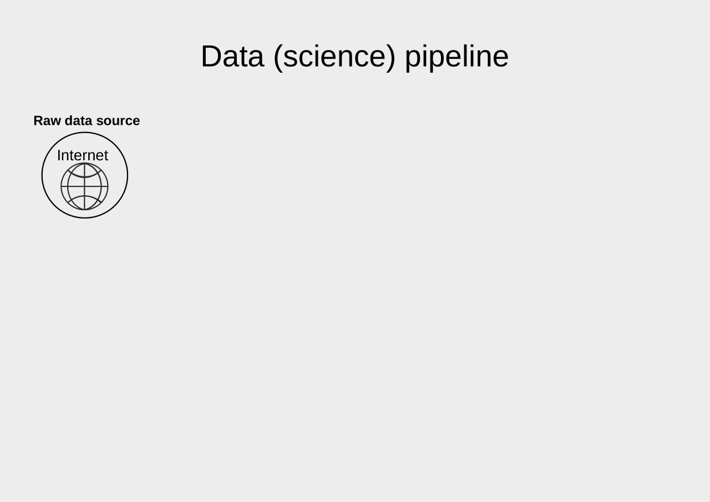
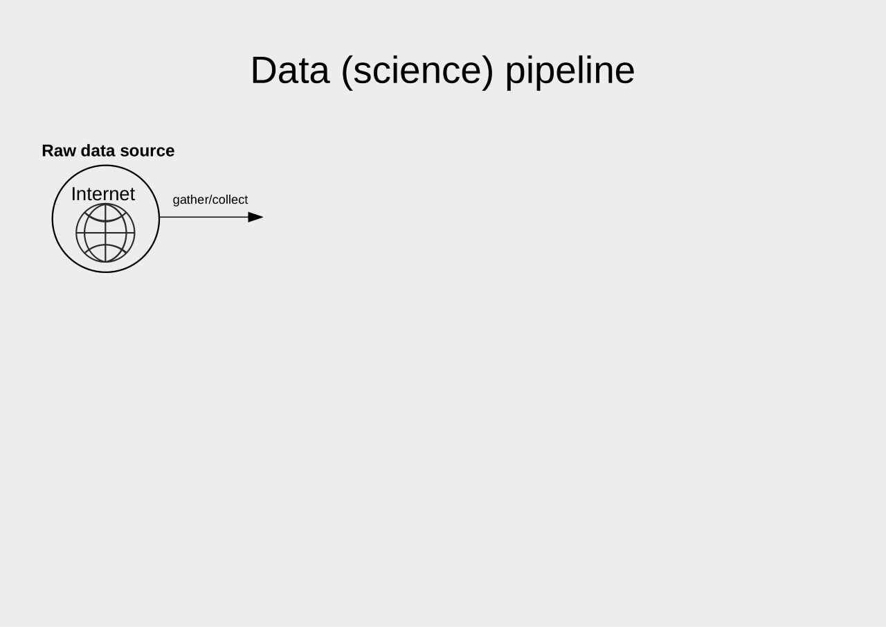
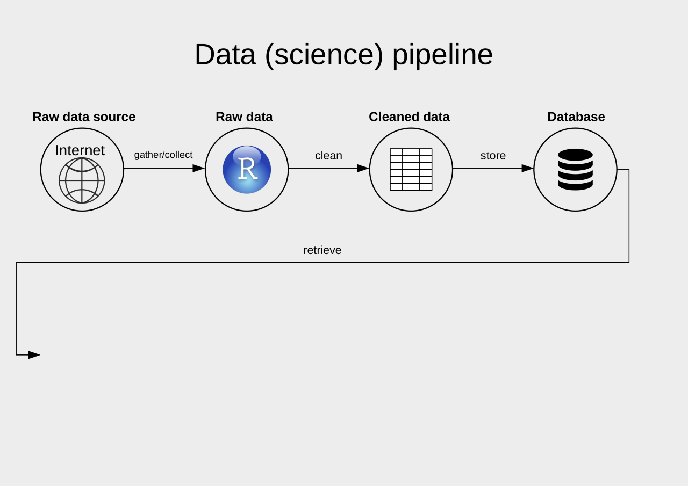
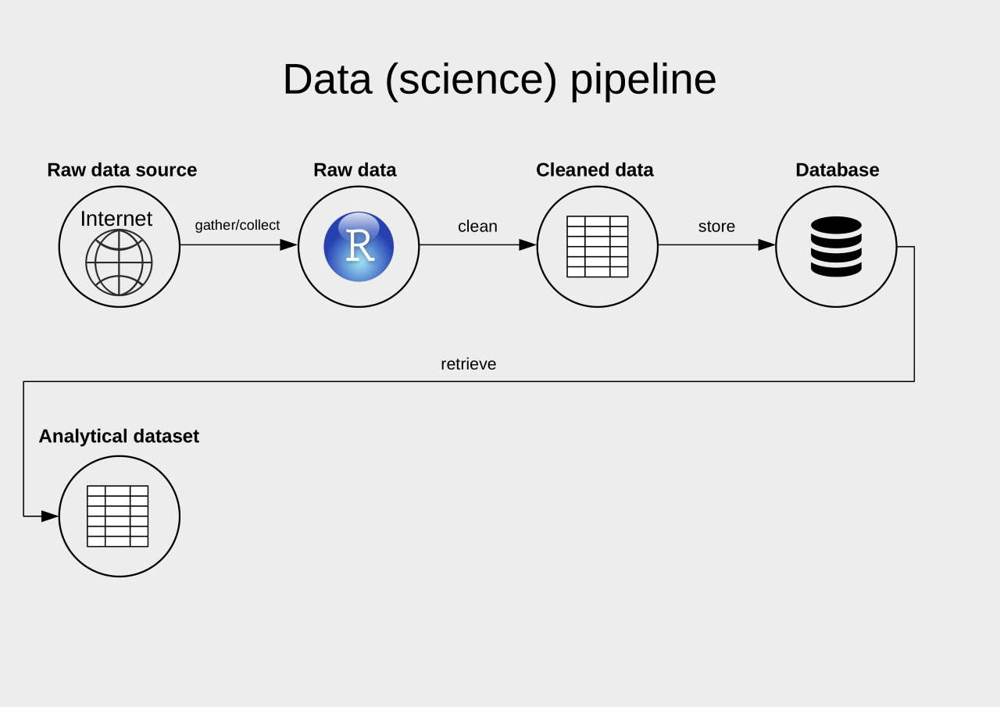
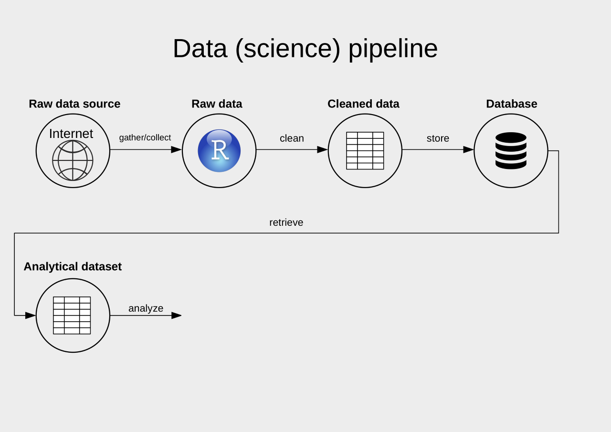
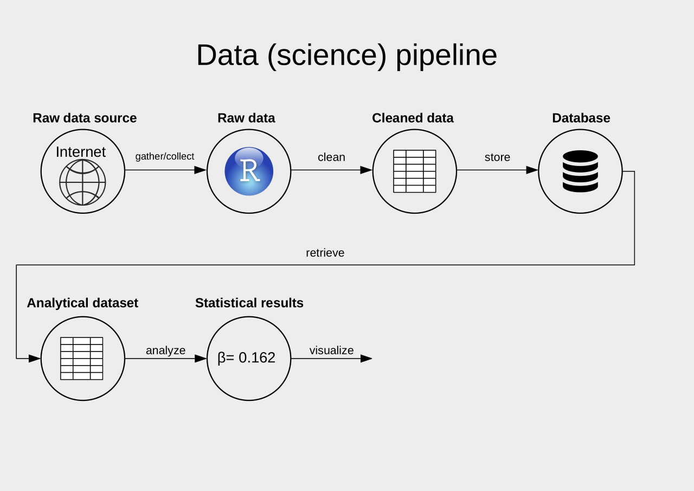
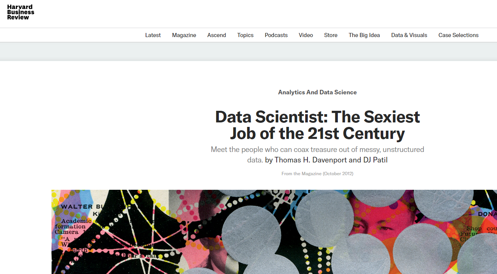
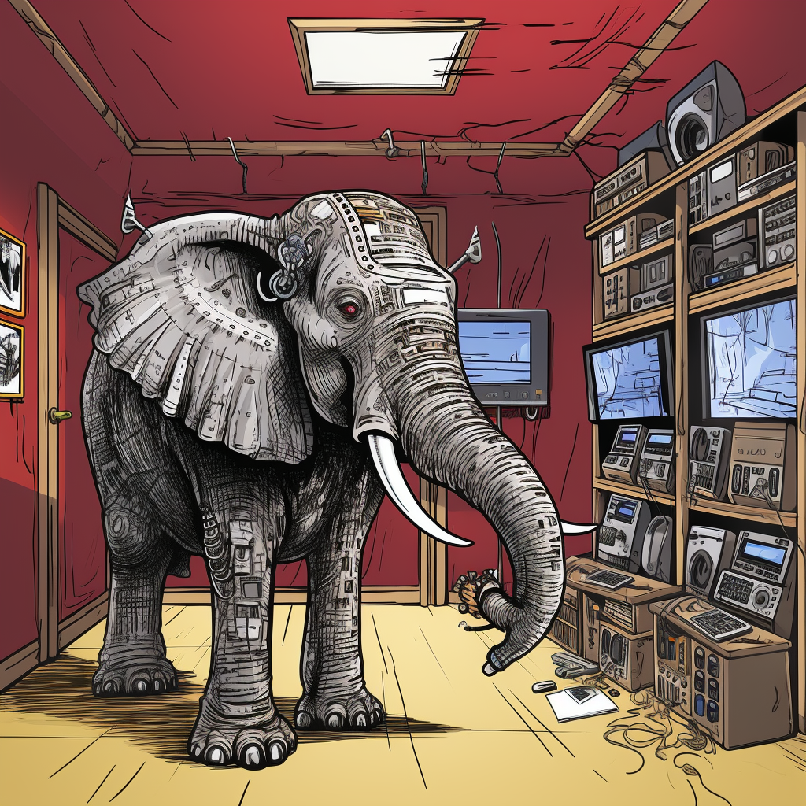
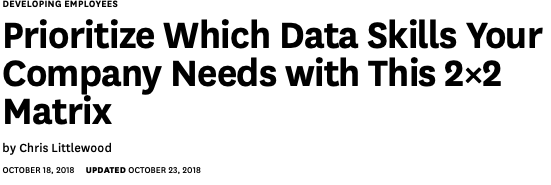

```{r set-options, echo=FALSE, cache=FALSE, warning=FALSE}
options(width = 100)
library(knitr)
```


## Welcome to Data Handling 2023!

- Go to this page (or use the QR code): https://tinyurl.com/data-handling2023
- Use one row to respond to the questions in the column headers (see the first two rows for examples).

```{r , echo=FALSE, out.width = "35%", fig.align='center', purl=FALSE}
include_graphics("../../img/tinyurl-data-handling2023.png")
```


---

```{r blackbox, echo=FALSE, out.width = "90%", fig.align='center', purl=FALSE}
include_graphics("../../img/cpu_blackbox_white.png")
```

---


```{r , echo=FALSE, out.width = "90%", fig.align='center', purl=FALSE}

```

---


```{r , echo=FALSE, out.width = "90%", fig.align='center', purl=FALSE}

```

---

```{r , echo=FALSE, out.width = "90%", fig.align='center', purl=FALSE}
include_graphics("../../img/ds3.png")
```

---

```{r , echo=FALSE, out.width = "90%", fig.align='center', purl=FALSE}
include_graphics("../../img/ds4.png")
```

---

```{r , echo=FALSE, out.width = "90%", fig.align='center', purl=FALSE}
include_graphics("../../img/ds5.png")
```

---

```{r , echo=FALSE, out.width = "90%", fig.align='center', purl=FALSE}
include_graphics("../../img/ds6.png")
```

---

```{r , echo=FALSE, out.width = "90%", fig.align='center', purl=FALSE}
include_graphics("../../img/ds7.png")
```

---

```{r , echo=FALSE, out.width = "90%", fig.align='center', purl=FALSE}

```

---

```{r , echo=FALSE, out.width = "90%", fig.align='center', purl=FALSE}

```

---

```{r , echo=FALSE, out.width = "90%", fig.align='center', purl=FALSE}

```

---

```{r , echo=FALSE, out.width = "90%", fig.align='center', purl=FALSE}
include_graphics("../../img/ds11.png")
```

---

```{r , echo=FALSE, out.width = "90%", fig.align='center', purl=FALSE}

```

---


```{r , echo=FALSE, out.width = "90%", fig.align='center', purl=FALSE}
include_graphics("../../img/ds13.png")
```

---

```{r , echo=FALSE, out.width = "90%", fig.align='center', purl=FALSE}
include_graphics("../../img/ds14.png")
```

---

```{r , echo=FALSE, out.width = "90%", fig.align='center', purl=FALSE}
include_graphics("../../img/data_science_pipeline.png")
```


# Background


## 'Data Science'?

*"This coupling of scientific discovery and practice involves the collection, management, processing, analysis, visualization, and interpretation of vast amounts of heterogeneous data associated with a diverse array of scientific, translational, and inter-disciplinary applications."*

University of Michigan 'Data Science Initiative', 2015


## But, what about statistics?!

*"Seemingly, statistics is being marginalized here; the implicit message is that statistics is a part of what goes on in data science but not a very big part. At the same time, many of the concrete descriptions of what the DSI will actually do will seem to statisticians to be bread-and-butter statistics. Statistics is apparently the word that dare not speak its name in connection with such an initiative!"*

David Donoho (2015). __50 years of Data Science__


## What's new about all this?

*"All in all, I have come to feel that my central interest is in data analysis, which I take to include, among other things: ..."*


## What's new about all this?

*"All in all, I have come to feel that my central interest is in data analysis, which I take to include, among other things: procedures for analyzing data, techniques for interpreting the results of such procedures, ways of planning the gathering of data to make its analysis easier, more precise or more accurate, and all the machinery and results of (mathematical) statistics which apply to analyzing data."*


## What's new about all this?

```{r tukey1, echo=FALSE, out.width = "40%", fig.align='center', purl=FALSE}
include_graphics("../../img/tukey.jpg")
```
<center>
John Tukey (_The Future of Data Analysis_, 1962!)
</center>


## Technological change

```{r computers, echo=FALSE, out.width = "90%", fig.align='center', purl=FALSE}
include_graphics("../../img/computers.jpg")
```


## Relevance for modern economic research

```{r css, echo=FALSE, out.width = "90%", fig.align='center',  purl=FALSE}
include_graphics("../../img/css.png")
```


## Relevance for modern economic research

```{r internet, echo=FALSE, out.width = "90%", fig.align='center',  purl=FALSE}
include_graphics("../../img/internet.png")
```


## Relevance for modern economic research

```{r bigdata, echo=FALSE, out.width = "90%", fig.align='center',  purl=FALSE}
include_graphics("../../img/bigdata.png")
```


## Relevance for modern economic research

```{r text, echo=FALSE, out.width = "90%", fig.align='center',  purl=FALSE}
include_graphics("../../img/text.png")
```


## Data science in economics skill set

```{r venn, echo=FALSE, out.width = "60%", fig.align='center',  purl=FALSE}
include_graphics("../../img/venn_diagramm.png")
```


## Data science as a life skill

```{r sexy, echo=FALSE, out.width = "80%", fig.align='center',  purl=FALSE}

```


## Data science as a life skill

"More than anything, what data scientists do is *make discoveries while swimming in data.* ...  As they make discoveries, they communicate what they’ve learned and suggest its implications for new business directions. Often they are *creative in displaying information visually and making the patterns they find clear and compelling*... 

They advise executives and product managers on the implications of the data for *products, processes, and decisions*.

What kind of person does all this? *Think of him or her as a hybrid of data hacker, analyst, communicator, and trusted adviser. The combination is extremely powerful — and rare.*"


# Organisation of the Course


## Our Team - At Your Service

|                      |                             |                             |
|----------------------|-----------------------------|-----------------------------|
|  |  |  |
| Matthias Rösti       | <strong>Andrea Burro</strong> | <strong>Aurélien Sallin</strong> |


## Introduction: Aurélien Sallin

- 2022-today: Expert in Health Care Research and Member of Management, \p SWICA Health Organization, Winterthur
- 2022-today: Post-Doc researcher and lecturer, HSG
- 2018-2022: PhD Economic and Finance, HSG

<br>

Previously: 


## Introduction: Aurélien Sallin

*Research at SWICA*

 - Using Real-World Data from claims to assess effectiveness of health technological tools
 - Using (Causal) Machine Learning to evaluate the effect of health policies on doctors' prescription behaviors
 - Financing models for mandatory health care in Switzerland

<br>

*Other Research in Economics of Education*

 - Missclassification rates for gifted students
 - Evaluation of Special Education programs


# Course Structure


## Course concept: lectures

- Lectures (Thursday morning)
    - Background/Concepts
    - Illustration concepts
    - Illustration of 'hands-on' approaches


## Course concept: special lectures

- *30.11.2023: Industry Insights*
    - Matteo Courthoud, PhD: Senior Economist at Zalando

<br>

- *14.12.2023: Federal Administration Insights*
    - Florian Chatagny, PhD: Head of Data Science Team, Federal Finance Administration


## Course concept: exercises

- Exercise sheets (handed out every other week)
  - Some conceptual questions
  - Hands-on exercises/tutorials in R
  - Detailed solution videos
  - *First Exercises (set up R/RStudio) is available on StudyNet/Canvas today*


## The Elefant in the Room

```{r elefantintheroom, echo=FALSE, out.width = "40%", fig.align='center',  purl=FALSE}

```

<br>

```r
# the symbolic representation of Artificial Intelligence as being the 
# "elefant in the room", comic cartoon style - Variations (Strong) 
```


## Course concept

- Learning mode in this course: Prepare with reading, visit the lecture, recap key concepts in lecture notes (self-study), work on exercises, watch solution video, come to exercise session, repeat...

- Strongly encouraged: (virtual) learning groups!
    - Biweekly exercises provide opportunity.
    - Tackle the tricky exercises together!


## Course concept: exercise sessions

- In-class exercise sessions (bi-weekly evening sessions)
    - Discussion of exercises and additional input 
    - Recap of concepts
    - Q&A, support
    - time for more coding!


## Part I: Data (Science) fundamentals {.smaller}

```{r echo = FALSE, warning=FALSE}
library(readxl)
library(knitr)
library(magrittr)
library(kableExtra)

sched <- read_xlsx("../../schedule2023.xlsx", col_types = "text")

kable(sched[1:9, c(1, 5)], format = "markdown")
```


## Part II: Data gathering and preparation {.smaller}

```{r echo = FALSE}
kable(sched[12:15, c(1, 5)], format = "markdown")
```


## Part III: Analysis, visualisation, output {.smaller}

```{r echo = FALSE}
kable(sched[16:nrow(sched), c(1, 5)], format = "markdown")
```


## Core course resources

- All information and materials (notes, slides, course sheet, syllabus, etc.) are available on StudyNet/Canvas.
- Core materials will also be made available on Nuvolos.


## Main textbooks

[Data Handling Pocket Reference](https://umatter.github.io/datahandling/)

[Murrell, Paul (2009). *Introduction to Data Technologies*, London: Chapman & Hall/CRC.](https://www.stat.auckland.ac.nz/~paul/ItDT/)

[Wickham, Hadley and Garred Grolemund (2017). *R for Data Science*, 1st Edition. Sebastopol, CA: O’Reilly.](http://r4ds.had.co.nz/)

[Baumer, Kaplan and Norton (2023). *Modern Data Science with R*, 2nd Edition. ](https://mdsr-book.github.io/mdsr3e/)


## Further resources

- [Stackoverflow](https://stackoverflow.com/questions)
- [Get inspired in the R blogsphere](https://www.r-bloggers.com)
- ChatGPT


## Exam information
- Central, written examination: *digital, BYOD!*, we will have an instructional session by the head of the digital examinations team (data TBD).
- Multiple choice questions.
- A few open questions.
- Theoretical concepts and practical applications in R (questions based on code examples).


## Exam information II
- We will release samples of  multiple choice questions via Quizzes on Canvas/Studynet (exact same format and style of exam questions).
- Exchange students who need to take the exam before the central exam block:
    - Date, time place, : *21.12.2023, 16:15-18:00, room tbd*.
    - Questions: *matthias.roesti@unisg.ch*

    

## And now this...




# Q&A


<style>
slides > slide { overflow: scroll; }
slides > slide:not(.nobackground):after {
  content: '';
}
</style>

## References {.smaller}
