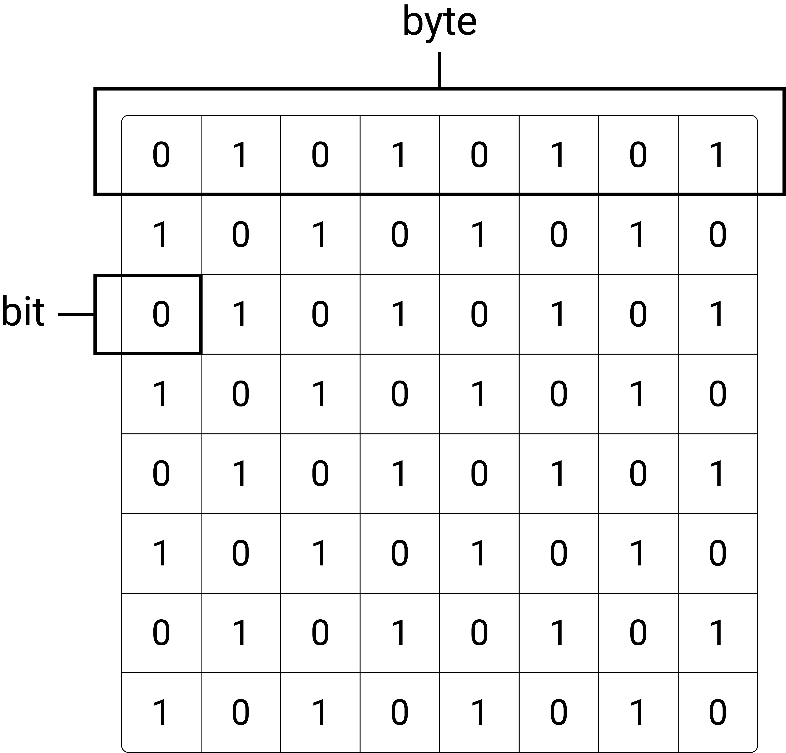
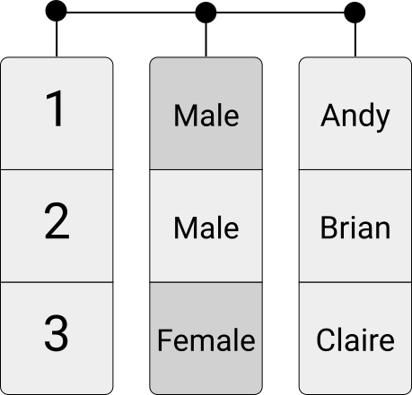
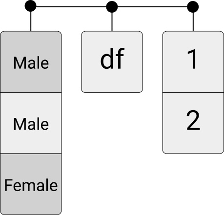

```{r set-options, echo=FALSE, cache=FALSE, warning=FALSE}
options(width = 100)
library(knitr)
knitr::opts_chunk$set(class.source = "chunkstyle")
```

```{css, echo=FALSE}
.chunkstyle {
  background-color: lightgrey;
}
```


# Updates


## Updates

- Forum on Canvas to discuss the solutions to the R-exercises


# Recap and warm-up

## The binary system

Microprocessors can only represent two signs (states):

 - 'Off' = `0`
 - 'On' = `1`

```{r onoff, echo=FALSE, out.width = "10%", fig.align='center', purl=FALSE}
include_graphics("../../img/on_off.png")
```


## The binary and the hexadecimal counting frames

**Binary:** 

- Only two signs: `0`, `1`.
- Base 2.
- Columns: $2^0=1$, $2^1=2$, $2^2=4$, and so forth.

<br>

**Hexadecimal:**

  - *16 symbols*:
  - `0`-`9` (used like in the decimal system)...
  - and `A`-`F` (for the numbers 10 to 15).


## Decimal numbers in a computer


Number  | 128 | 64 | 32 | 16 | 8  | 4  | 2  |  1
-----|-----|----|----|----|----|----|----|----
0  = | 0   |  0 | 0  |  0 | 0 |  0 | 0  |  0
1  = | 0   |  0 | 0  |  0 | 0 |  0 | 0  |  1
2  = | 0   |  0 | 0  |  0 | 0 |  0 | 1  |  0
3  = | 0   |  0 | 0  |  0 | 0 |  0 | 1  |  1
... |    |   |   |  |  |   |   |
139 = | 1   |  0 | 0  |  0 |  1 |  0 | 1  |  1


## Decimal numbers in hexadecimal


Number  | ... | $16^2=256$  | $16^1=16$  |  $16^0=1$
------|-----|----|----|----|
0  =  | ... |  0 | 0  |  0
1  =  | ... |  0 | 0  |  1
15 =  | ... |  0 | 0  |  F
16 =  | ... |  0 | 1  |  0
256 = | ... |  1 | 0  |  0
...  | ... |    |    |   
139 = | 0  |  0 | 8  |  B


## Computers and text
How can a computer understand text if it only understands `0`s and `1`s?

- *Standards* define how `0`s and `1`s correspond to specific letters/characters of different human languages.
- These standards are usually called *character encodings*.
- Coded character sets that map unique numbers (in the end in binary coded values) to each character in the set.
- For example, ASCII (American Standard Code for Information Interchange) or *utf-8*.

```{r ascii, echo=FALSE, out.width = "30%", fig.align='center', fig.cap='ASCII logo. (public domain).', purl=FALSE}
include_graphics("../../img/ascii.gif")
```


## Digital data processing

&nbsp;

```{r components, echo=FALSE, out.width = "80%", fig.align='center', purl=FALSE}
include_graphics("../../img/script-hardware.jpg")
```


## Digital data processing: a detour through bytes

&nbsp;

We saw last week in our example that the size in RAM of our "economist" html object was `468048 bytes`.

```{r, eval = FALSE}
economistText <- content(economist, as = "text")
print(economistText)

object.size(economist)
pryr::object_size(economist)
```


## Digital data processing: a detour through bytes

---

```{r bitbyteword, echo=FALSE, out.width = "80%", fig.align='center',  purl=FALSE}

```


## Bigger units for storage capacity 

 - $1 \text{ kilobyte (KB)} = 1000^{1} \text{ bytes}$
 - $1 \text{ megabyte (MB)} = 1000^{2} \text{ bytes}$
 - $1 \text{ gigabyte (GB)} = 1000^{3} \text{ bytes}$
 
<!-- ## Common units for data transfer (over a network) -->

<!--  - $1 \text{ kilobit per second (kbit/s)} = 1000^{1} \text{ bit/s}$ -->
<!--  - $1 \text{ megabit per second (mbit/s)} = 1000^{2} \text{ bit/s}$ -->
<!--  - $1 \text{ gigabit per second (gbit/s)} = 1000^{3} \text{ bit/s}$ -->


# Warm-up: Quiz on Canvas


# Computer Code and Data Storage

## Computer code

  - Instructions to a computer, in a language it understands... (R)
  - Code is written to *text files*
  - Text is 'translated' into 0s and 1s which the CPU can process.

## Data storage

- Data usually stored in *text files*

  - Read data from text files: data import.
  - Write data to text files: data export.


## Unstructured data in text files

- Store `Hello World!` in `helloworld.txt`.
  - Allocation of a block of computer memory containing `Hello World!`.
  - Simply a sequence of `0`s and `1`s...
  - `.txt` indicates to the operating system which program to use when opening this file.
- Encoding and format tell the computer how to interpret the `0`s and `1`s.


## Inspect a text file

Interpreting `0`s and `1`s as text...

```{bash eval=FALSE}
cat helloworld.txt; echo
```

```{bash echo=FALSE}
cat ../../data/helloworld.txt; echo
```

Or, from the R-console:
```{R eval=FALSE}
system("cat helloworld.txt")
```


## Inspect a text file

Directly looking at the `0`s and `1`s...

```{bash eval = FALSE}
xxd -b helloworld.txt
```

```{bash echo = FALSE, eval = FALSE}
xxd -b ../../data/helloworld.txt
```

```{}
00000000: 01001000 01100101 01101100 01101100 01101111 00100000  Hello 
00000006: 01010111 01101111 01110010 01101100 01100100 00100001  World!
```

## Inspect a text file

Similarly we can display the content in hexadecimal values:


```{bash eval = FALSE}
xxd  data/helloworld.txt
```

```{bash echo = FALSE, eval = FALSE}
xxd  ../../data/helloworld.txt
```

```{}
00000000: 4865 6c6c 6f20 576f 726c 6421            Hello World!
```


## Encoding issues

```{bash eval=FALSE}
cat hastamanana.txt; echo
```

```
## Hasta Ma?ana!
```

- What is the problem?


## Encoding issues
Inspect the encoding

```{bash eval = FALSE}
file -b hastamanana.txt
```


```{bash echo = FALSE}
file -b ../../data/hastamanana.txt
```


## Use the correct encoding

Read the file again, this time with the correct encoding

<style>
.lit {
  color: white;
}
</style>

```{bash eval = FALSE}
iconv -f iso-8859-1 -t utf-8 hastamanana.txt | cat
```

```{bash echo = FALSE}
iconv -f iso-8859-1 -t utf-8 ../../data/hastamanana.txt | cat
```


## UTF encodings
  - 'Universal' standards.
  - Contain broad variety of symbols (various languages).
  - Less problems with newer data sources...


## Take-away message
  - *Recognize an encoding issue when it occurs!*
  - Problem occurs right at the beginning of the *data pipeline*!
    - Rest of pipeline affected...
    - ... cleaning of data fails ...
    - ... analysis suffers.


# From text to data structure


## Structured Data Formats

  - We are used to not thinking about the formats of our data... and let the computer choose what to do with data when we click on a file.
  - All data are text files, but with standardized *structure*.
  - *Special characters* define the structure.
  - More complex *syntax*, more complex structures can be represented...


## Table-like formats

Example `ch_gdp.csv`. 

```{}
year,gdp_chfb
1980,184
1985,244
1990,331
1995,374
2000,422
2005,464
```

<center>
*What is the structure?*
</center>


## Table-like formats

- What is the reocurring pattern? 
  - Special character `,`
  - New lines
  - Table is visible from structure in raw text file...

<br>

<center>
*How can we instruct a computer to read this text as a 6-by-2 table?*
</center>

---

<br>

<center>
<h4>A simple *parser* algorithm</h4>
</center>


## CSVs and fixed-width format

  - *'Comma-Separated Values'* (therefore `.csv`)
    - commas separate values
    - other delimiters (`;`, tabs, etc.) possible
    - new lines separate rows/observations
  - Instructions of how to read a `.csv`-file: *CSV parser*.


---

<br>

<h4>How does the computer know that the end of a line is reached?</h4>


```{}
00000000: efbb bf79 6561 722c 6764 705f 6368 6662  ...year,gdp_chfb
00000010: 0d31 3938 302c 3138 340d 3139 3835 2c32  .1980,184.1985,2
00000020: 3434 0d31 3939 302c 3333 310d 3139 3935  44.1990,331.1995
00000030: 2c33 3734 0d32 3030 302c 3432 320d 3230  ,374.2000,422.20
00000040: 3035 2c34 3634                           05,464
```


## CSVs and fixed-width format

  - Common format to store and transfer data.
  - Very common in a data analysis context.
  - Natural format/structure when the dataset can be thought of as a table.


## More complex formats
  - N-dimensional data
  - Nested data
  - *XML*, *JSON*, *YAML*, etc.
    - Often encountered online!
    - (Next lecture!)


<!-- # Units of Information/Data Storage -->

<!-- --- -->

<!-- ```{r bitbyteword, echo=FALSE, out.width = "80%", fig.align='center',  purl=FALSE} -->
<!--  -->
<!-- ``` -->


<!-- ## Bigger units for storage capacity  -->

<!--  - $1 \text{ kilobyte (KB)} = 1000^{1} \text{ bytes}$ -->
<!--  - $1 \text{ megabyte (MB)} = 1000^{2} \text{ bytes}$ -->
<!--  - $1 \text{ gigabyte (GB)} = 1000^{3} \text{ bytes}$ -->

<!-- <!-- ## Common units for data transfer (over a network) --> 

<!-- <!--  - $1 \text{ kilobit per second (kbit/s)} = 1000^{1} \text{ bit/s}$ --> 
<!-- <!--  - $1 \text{ megabit per second (mbit/s)} = 1000^{2} \text{ bit/s}$ --> 
<!-- <!--  - $1 \text{ gigabit per second (gbit/s)} = 1000^{3} \text{ bit/s}$ --> 


# Data Structures and Data Types in R

## Structures to work with...

- Data structures for storage on hard drive (e.g., csv).
- Representation of data in RAM (e.g. as an R-object)
  - What is the representation of the 'structure' once the data is parsed (read into RAM)?

## Structures to work with (in R)

We distinguish two basic characteristics:

  1. Data types:
      - *integers*; 
      - *real numbers* ('numeric values', 'doubles', floating point numbers); 
      - *characters* ('string', 'character values');
      - (*booleans*)
    
    
    
## Structures to work with (in R)

We distinguish two basic characteristics:

  1. Data types.
  2. Basic data structures in RAM:
      - *Vectors*
      - *Factors*
      - *Arrays/Matrices*
      - *Lists*
      - *Data frames* (very `R`-specific)


## Describe data 

The `type` and the `class` of an object can be used to describe an object.

  - *type*: technical and low-level description of the actual storage mode or physical representation of an object. 
    - It tells *how the object is stored in memory*.
  <br>
  
  - *class*: attribute about the nature of an `R` object.
    - It tells you *how to treat the object in a broad sense*.


## Data types: numeric and integers

R interprets these bytes of data as type `double` ('numeric') or type `integer`:


```{r}
a <- 1.5
b <- 3
c <- 3L

# Use math operators
a + b
```


## Data types: numeric and integers

```{r}
a <- 1.5
typeof(a); class(a)

c <- 3L
typeof(c); class(c)
```


<!-- ## Data types: numeric -->


<!-- Given that these bytes of data are interpreted as numeric, we can use operators (here: math operators) that can work with such functions: -->

<!-- ```{r} -->
<!-- a + b -->
<!-- ``` -->


## Data types: character


```{r}
a <- "1.5"
b <- "3"
```

```{r}
typeof(a)
class(a)
```

Now the same line of code as above will result in an error:

```{r error=TRUE}
a + b
```


## Data types: special values

  - `NA`: "Not available", i.e. missing value for any type
  - `NaN`: "Not a number": special case of NA for numeric
  - `Inf`: specific to numeric
  - `NULL`: absence of value


## Data structures: vectors

<!-- ```{r numvec, echo=FALSE, out.width = "10%", fig.align='center', purl=FALSE} -->
<!-- include_graphics("../../img/numvec.png") -->
<!-- ``` -->

<!-- ## Data structures: vectors -->

<!-- Example: -->

- Collections of value of same type

```{r}
persons <- c("Andy", "Brian", "Andy")
persons
```

```{r}
ages <- c(24, 50, 30)
ages
```


## Data structures: vectors

What happens when you create a vector out of `persons` and `ages`?
```{r, eval = FALSE}
c(persons, ages)
```


## Data structures: factors

- Factors are sets of categories. 
- The values come from a fixed set of possible values.

```{r factor, echo=FALSE, out.width = "10%", fig.align='center',  purl=FALSE}
include_graphics("../../img/factor.png")
```

## Data structures: factors

Example:

```{r}
gender <- factor(c("Male", "Male", "Female"))
gender
```

Factors are "disguised" integers...

```{r}
typeof(gender)
```

## Data structures: factors

Two components: 

  - the integer (or "levels");
  - the labels.
  
```{r}
levels(gender)
```


## Data structures: matrices

Matrices are two-dimensional collections of values of the same type

```{r matrix, echo=FALSE, out.width = "30%", fig.align='center', purl=FALSE}
include_graphics("../../img/matrix.png")
```


## Data structures: arrays

Arrays are higherdimensional collections of values of the same type

```{r array, echo=FALSE, out.width = "40%", fig.align='center', purl=FALSE}
include_graphics("../../img/array.jpg")
```


## Data structures: matrices/arrays

Example:

```{r}
my_matrix <- matrix(c(1,2,3,4,5,6), nrow = 3)
my_matrix
```


## Data structures: matrices/arrays

```{r}
my_array <- array(c(1,2,3,4,5,6,7,8), dim = c(2,3,4))
my_array
```


## Data frames, tibbles, and data tables

  - Each column contains a vector of a given data type (or factor), but all columns need to be of identical length.
  - `data.frame`, `tibble`, `data.table`
  
```{r df, echo=FALSE, out.width = "40%", fig.align='center',  purl=FALSE}

```


## Data frames, tibbles, and data tables

Example: 

```{r}
df <- data.frame(person = persons, age = ages, gender = gender)
df

```


## Data structures: lists

Lists can contain different data types in each element, or even different data structures of different dimensions.

```{r list, echo=FALSE, out.width = "40%", fig.align='center', purl=FALSE}

```


## Data structures: lists

Example:

```{r}
my_list <- list(my_array, my_matrix, df)
my_list
```

## Data structures: recap
```{r matrix, echo=FALSE, out.width = "30%", fig.align='center', purl=FALSE}
include_graphics("../../img/data_structure_R.png")
```

## Data structures: most common attributes

  - Names and dimnames
  - dim
  - class
  - levels
  - length


## Data structure: most common attributes

```{r}
x <- c(a=1, b=2, c=3)
names(x)

m <- matrix(1:6, nrow=2)
dim(m)
dimnames(m) <- list(c("row1", "row2"), c("col1", "col2", "col3"))
m
```


<!-- ## Data structures and data types: coercion -->

<!-- *Coercion* is the process of converting an object from one data type to another.  -->

<!--   - *Implicit Coercion*: happens automatically when combining objects of different types without explicitly requesting a conversion.  -->
<!--   - *Explicit Coercion*: use specific functions to manually convert one type of data into another. -->


<!-- ## Implicit coercion -->

<!-- R will implicitly coerce to the most flexible type. -->

<!-- ```{r} -->
<!-- mixed2 <- c(TRUE, 2, 3) -->
<!-- mixed2 -->
<!-- ``` -->


<!-- ## Explicit coercion -->

<!-- Use functions like `as.numeric()`, `as.character()`, `as.logical()`, to convert data types. -->

<!-- ```{r} -->
<!-- as.numeric(c("1.2", "3.4", "5.6")) -->
<!-- as.numeric(c("1.2", "a", "5.6")) -->
<!-- as.integer(c(1.2, 2.9, 3.7)) -->
<!-- ``` -->


# Q&A


<style>
slides > slide { overflow: scroll; }
slides > slide:not(.nobackground):after {
  content: '';
}


code {
  color: white;
}


pre {
  color: white;
}
</style>

## References {.smaller}

