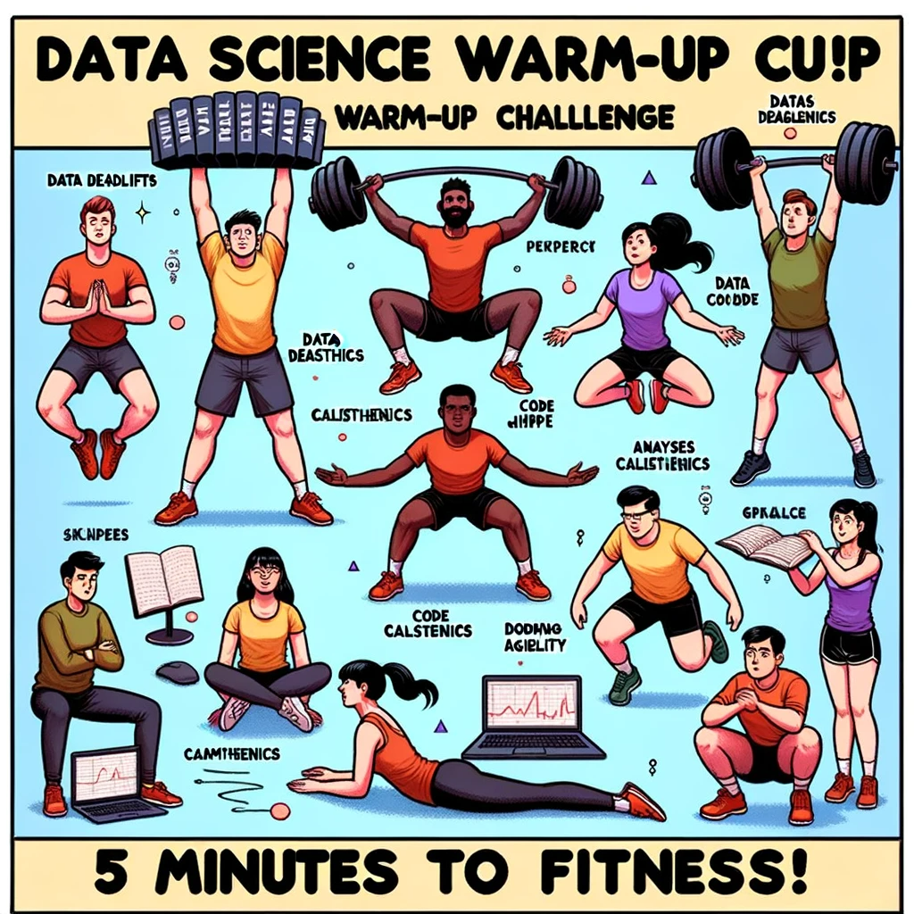

```{r set-options, echo=FALSE, cache=FALSE, warning=FALSE}
options(width = 100)
library(knitr)
knitr::opts_chunk$set(class.source = "chunkstyle")
```

```{css, echo=FALSE}
.chunkstyle {
  background-color: lightgrey;
}
```


# Updates

## Updates
- Exercises/Practical case for lecture 4: available online.
- Discuss the solutions on the forum in Canvas.
- These exercises are exam-relevant.


# Recap and Warm-up


## Structured Data Formats

  - Still text files, but with standardized *structure*.
  - *Special characters* define the structure.
  - More complex *syntax*, more complex structures can be represented...
  - Example: using a **parser** to work with a csv file. 


## Structures to work with (in R)

We distinguish two basic characteristics:

  1. Data types:
      - *integers*; 
      - *real numbers* ('numeric values', 'doubles', floating point numbers); 
      - *characters* ('string', 'character values');
      - (*booleans*)
  
  2. Basic *data structures* in RAM:
      - *Vectors*
      - *Factors*
      - *Arrays/Matrices*
      - *Lists*
      - *Data frames* (very `R`-specific)


## Erratum 

The following code does not throw an error. `R` throws a `warning()` but fills the matrix restarting from the beginning of the vector. 
```{r warning=TRUE}
erratum <- matrix(1:13, nrow = 3)
erratum
```


## Warm-up

```{r df, echo=FALSE, out.width = "40%", fig.align='left',  purl=FALSE}

```

<!-- ```{} -->
<!-- Illustration parodying a fitness warm-up poster in a college data science setting. Diverse students are depicted in humorous workout poses: 'Data Deadlifts', where a student lifts heavy books labeled 'Data'; 'Code Calisthenics', showing students jumping while coding; and 'Analysis Agility', with a student dodging falling graphs. The poster title proclaims 'Data Science Warm-Up Challenge: 5 Minutes to Fitness!' -->
<!-- ``` -->


## Data structure

```{}
00000000: efbb bf6e 616d 652c 6167 655f 696e 5f79  ...name,age_in_y
00000010: 6561 7273 0d0a 4a6f 686e 2c32 340d 0a41  ears..John,24..
00000020: 6e6e 612c 3239 0d0a 4265 6e2c 3331 0d0a  nna,29..Ben,31..
00000030: 4c69 7a2c 3334 0d0a 4d61 782c 3237       Liz,34..Max,27
```

- Describe this code. What are these digits? What do they represent?


## Data structure

```{}
00000000: efbb bf6e 616d 652c 6167 655f 696e 5f79  ...name,age_in_y
00000010: 6561 7273 0d0a 4a6f 686e 2c32 340d 0a41  ears..John,24..
00000020: 6e6e 612c 3239 0d0a 4265 6e2c 3331 0d0a  nna,29..Ben,31..
00000030: 4c69 7a2c 3334 0d0a 4d61 782c 3237       Liz,34..Max,27
```

- Describe this code. What are these digits? What do they represent?
- Which encoding is used here?
- Can you identify the EOL (End-of-Line) character?
- Can you identify the comma?


## Matrices

What is the output of the following code?

```{r, eval = FALSE}
my_matrix <- matrix(1:12, nrow = 3)
dim(my_matrix)
```

## Matrices

What happens with this command? (Multiple answers can be correct)

```{r}
my_matrix <- cbind(c(1,2,3, 4), c("a", "b", "c", "a"), c(TRUE, FALSE, TRUE, TRUE))
```
- `R` creates a matrix of dimension 3, 4
- `my_matrix[2, 1] == "2"` gives the solution `TRUE`
- `R` must coerce the data to a common type to accommodate all different values
- `mean(my_matrix[,1]) == 2.5` returns `2.5`


## Factors

What does the following code produce?

```{r, eval = FALSE}
fruits <- factor(c("apple", "banana", "apple", "cherry"))

levels(fruits)
as.numeric(fruits)
```


# Data in Economics

## Data 

*Rectangular data*

- Rectangular data refers to a data structure where information is organized into *rows* and *columns*.
  - Each row represents an observation or instance of the data.
  - Each column represents a variable or feature of the data.

<br>

*Non-rectangular data*


## Data

*Rectangular data*

- Rectangular data refers to a data structure where information is organized into *rows* and *columns*.
  - CSV (typical for rectangular/table-like data) and variants of CSV (tab-delimited, fix length etc.)
  - Excel spreadsheets (`.xls`)
  - Formats specific to statistical software (SPSS: `.sav`, STATA: `.dat`, etc.)
  - Built-in R datasets
  - Binary formats

<br>

*Non-rectangular data*


## Data

*Rectangular data*

<br>

*Non-rectangular data*

- Hierarchical data (xml, html, json)
  - <span style="color: gray">XML and JSON (useful for complex/high-dimensional data sets)</span>.
  - <span style="color: gray">HTML (a markup language to define the structure and layout of webpages)</span>.
- Time series data
- Unstructed text data
- Images/Pictures data 


<!-- While we will cover/revisit how to import all of these formats here, it is important to keep in mind that the learned fundamental concepts are as important (or more important) than knowing which function to call in R for each of these cases. New formats might evolve and become more relevant in the future for which no R function yet exists. However, the underlying logic of how formats to structure data work will hardly change. -->


# Working with rectangular data in R


# Loading/Importing Rectangular Data

## Loading built-in datasets

In order to load such datasets, simply use the `data()`-function:

```{r eval=TRUE}
data(swiss)
```

## Inspect the data after loading

```{r eval=TRUE}
# inspect the structure
str(swiss)

# look at the first few rows
head(swiss)
```


# Importing Rectangular Data from Text-Files


## Comma Separated Values (CSV)

The `swiss`-dataset would look like this when stored in a CSV:
  
  ```{}
"District","Fertility","Agriculture","Examination","Education","Catholic","Infant.Mortality"
"Courtelary",80.2,17,15,12,9.96,22.2
```

<center>
  *What do we need to read this format properly?*
</center>
  

## Parsing CSVs in R
  
- `read.csv()` (basic R distribution)
- Returns a `data.frame`

```{r eval=TRUE, echo=FALSE, purl=FALSE}
swiss_imported <- read.csv("../../data/swiss.csv")
```


```{r eval=FALSE, purl=FALSE}
swiss_imported <- read.csv("data/swiss.csv")
```


## Parsing CSVs in R

- Alternative: `read_csv()` (`readr`/`tidyr`-package) 
- Returns a `tibble`. 
- Used in @wickham_grolemund2017.

```{r eval=TRUE, echo=FALSE, message=FALSE, warning=FALSE, purl=FALSE}
library(readr)
swiss_imported <- read_csv("../../data/swiss.csv")
```


```{r eval=FALSE, purl=FALSE}
swiss_imported <- read_csv("data/swiss.csv")
```


## Import and parsing with `readr`

- Why `readr`?
  - Functions for all common rectangular data formats.
- Consistent syntax.
- More robust and faster than similar functions in basic R.
- Alternative: The `data.table`-package (handling large datasets).


## Basic usage of `readr` functions

Parse the first lines of the swiss dataset directly like this...

```{r}
library(readr)

read_csv('"District","Fertility","Agriculture","Examination","Education","Catholic","Infant.Mortality"
"Courtelary",80.2,17,15,12,9.96,22.2')

```

or read the entire `swiss` dataset by pointing to the file
```{r eval=FALSE}
swiss <- read_csv("data/swiss.csv")
```


```{r echo=FALSE, purl=FALSE}
swiss <- read_csv("../../data/swiss.csv")
```


## Basic usage of `readr` functions

In either case, the result is a `tibble`: 
```{r}
swiss
```

## Basic usage of `readr` functions


- Other `readr` functions have practically the same syntax and behavior.
- `read_tsv()` (tab-separated)
- `read_fwf()` (fixed-width)
- ...


## Parsing CSVs

Recognizing columns and rows is one thing...

```{r}
swiss
```

<center>
*What else did `read_csv()` recognize?*
</center>
  
## Parsing CSVs
  
- Recall the introduction to data structures and data types in R
- How does R represent data in RAM
- *Structure*: `data.frame`/`tibble`, etc.
- *Types*: `character`, `numeric`, etc.
- Parsers in `read_csv()` guess the data *types*.


## Parsing CSV-columns

- `"12:00"`: type `character`?
  
  
## Parsing CSV-columns
  
  - `"12:00"`: type `character`?
  - What about `c("12:00", "midnight", "noon")`?

## Parsing CSV-columns
  
  - `"12:00"`: type `character`?
  - What about `c("12:00", "midnight", "noon")`?
  - And now `c("12:00", "14:30", "20:01")`?
  
## Parsing CSV-columns
  
  *Let's test it!*

```{r}
read_csv('A,B
12:00, 12:00
14:30, midnight
20:01, noon')
```

## Parsing CSV-columns

*Let's test it!*
  
```{r}
read_csv('A,B
         12:00, 12:00
         14:30, midnight
         20:01, noon')
```

<center>
  *How can `read_csv()` distinguish the two cases?*
  </center>
  
  
## Parsing CSV-columns: guess types
  
Under the hood `read_csv()` used the `guess_parser()`- function to determine which type the two vectors likely contain:
  
```{r}
guess_parser(c("12:00", "midnight", "noon"))
guess_parser(c("12:00", "14:30", "20:01"))
```


# Other Common Rectangular Formats

## Spreadsheets/Excel

Needs additional R-package: `readxl`.

```{r eval=FALSE, warning=FALSE}
# install the package 
install.packages("readxl")
```

## Spreadsheets/Excel

Then we load this additional package ('library') and use the package's `read_excel()`-function to import data from an excel-sheet. 


```{r echo=FALSE, purl=FALSE, warning=FALSE, message=FALSE}
# load the package
library(readxl)

# import data from a spreadsheet
swiss_imported <- read_excel("../../data/swiss.xlsx")
```


```{r eval=FALSE}
# load the package
library(readxl)

# import data from a spreadsheet
swiss_imported <- read_excel("data/swiss.xlsx")
```

## Data from other data analysis software 

- STATA, SPSS, etc.
- Additional packages needed:
    - `foreign`
    - `haven`
- Parsers (functions) for many foreign formats.
    - For example, `read_spss()` for SPSS' `.sav`-format.


## Data from other data analysis software 

```{r echo=FALSE, purl=FALSE, warning=FALSE}
# install the package (if not yet installed):
# install.packages("haven")

# load the package
library(haven)

# read the data
swiss_imported <- read_spss("../../data/swiss.sav")

```

```{r eval=FALSE}
# install the package (if not yet installed):
# install.packages("haven")

# load the package
library(haven)

# read the data
swiss_imported <- read_spss("data/swiss.sav")

```


# Encoding Issues

## Recognize the problem

```{r}
FILE <- "../../data/hastamanana.txt"
hasta <- readLines(FILE)
hasta
```

(`readLines()` simply reads the content of a text file line by line.)

## Guess encoding

- Recall that there are no meta data in csv or plain text file informing you about the encoding.
- If no other information is available, we need to make an educated guess.
- `readr` provides a function that does just that: `guess_encoding()`

```{r}
guess_encoding(FILE)
```


## Handling encoding issues

- `inconv()`: convert a character vector `from` one encoding `to` another encoding.
- Use the guessed encoding for the `from` argument

```{r}
iconv(hasta, from = "ISO-8859-2", to = "UTF-8")
```


```{r}
iconv(hasta, from = "ISO-8859-1", to = "UTF-8")
```


# Q&A


<style>
slides > slide { overflow: scroll; }
slides > slide:not(.nobackground):after {
  content: '';
}


</style>

## References {.smaller}

