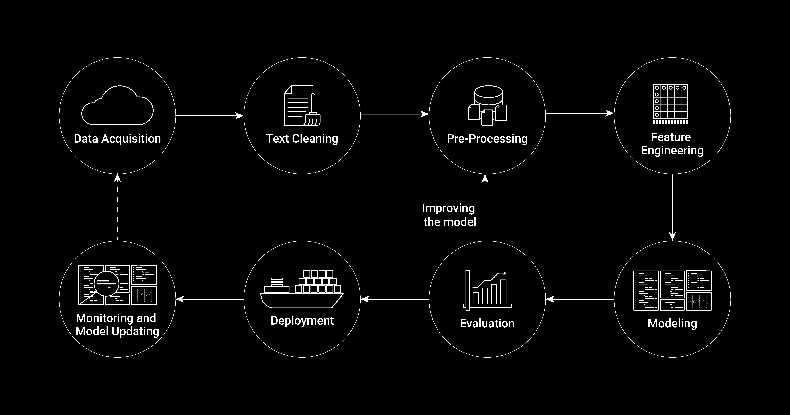
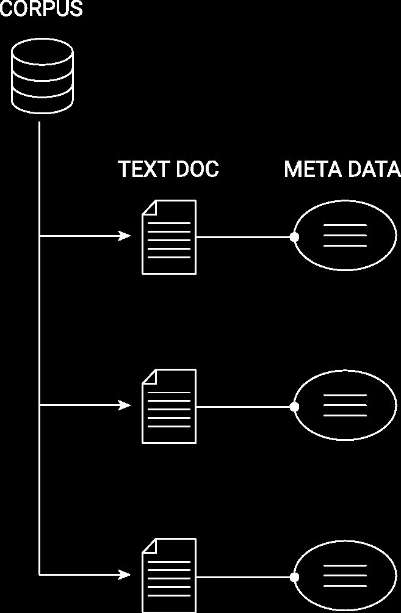

```{r set-options, echo=FALSE, message=FALSE, warning=FALSE, cache=FALSE}
options(width = 100)
library(knitr)
library(dplyr)
```


<style>
pre {
  font-size: 21px;
}
</style>


# Updates

## Updates

- Exam for exchange students: 21.12.2023 at 16:15 in room 10-013.
- Don't forget the exercise from lecture 5 💣


# Recap

## Data 

*Rectangular data*

- Rectangular data refers to a data structure where information is organized into *rows* and *columns*.
  - CSV (typical for rectangular/table-like data) and variants of CSV (tab-delimited, fix length etc.)
  - Excel spreadsheets (`.xls`)
  - Formats specific to statistical software (SPSS: `.sav`, STATA: `.dat`, etc.)
  - Built-in R datasets
  - Binary formats

<br>


## Warm-up

```{r df, echo=FALSE, out.width = "50%", fig.align='center',  purl=FALSE}
include_graphics("../../img/warmup_dalle.png")
```


## Coercion of boolean values

This question checks your understanding of the coercion of boolean values.

What is the output of the following code?
```{r echo = TRUE, eval = FALSE}
my_vector <- c(1, 0, 3, -1)
as.numeric(my_vector > 0)
```

- `c("TRUE", "FALSE", "TRUE", "FALSE")`
- `c(TRUE, FALSE, TRUE, FALSE)`
- `c(1,0,1,0)`
- `c(0,1,0,1)`


## Data frames operations

Be the data frame

```{r echo = TRUE}
dataCHframe <- data.frame(
  "City" = c("St.Gallen", "Lausanne", "Zürich"),
  "PartyLeft" = c(35, 45, 55),
  "PartyRight" = c(40, 35, 30)
)
```

Which of these statements are TRUE?

- `dataCHframe$PartyCenter <- c(25, 20, 15)` creates a new variable called "PartyCenter"
- `dim(dataCHframe[, dataCHframe$PartyLeft > 40])` returns the same as `dim(dataCHframe[, c(2,3)])`
- `dim(dataCHframe[dataCHframe$PartyLeft > 40 | dataCHframe$PartyLeft < 40, ])` returns `c(3,3)`
- `dataCHframe` is a list consisting of one named character vector and two named integer vectors.


## Working with csv files

You want to import a file using `read_delim()`. Describe what `read_delim()` does under the hood. What should be added to this command in order for it to work?

<!-- 1. recognize the separator and EOL -->
<!-- 2. use `guess_parser` to understand what data *type* hides behind each data structure -->
<!-- 3.  -->


## Tibbles

Be the code

```{r}
df <- data.frame(a = c(1,2,3,4),
                 b = c("au", "de", "ch", "li"))
```

Are these statements TRUE or FALSE?

- `mean(df$a) == 2.5`
- `typeof(as.matrix(df)[,1])` is `numeric` (or `double`)


## 

Statement for illustrative purposes (just for you to see it once, not that I expect you to learn this)

- `as_tibble(df)[1:2,1]` contains the same information as `df[1:2, 1]` but the formatting is different. 

```{r}
as_tibble(df)[1:2,1]
df[1:2, 1]
```


# Web Data, Complex Data Structures

## Data

*Rectangular data*

<br>

*Non-rectangular data*

- Hierarchical data (xml, html, json)
  - <span style="color: gray">XML and JSON (useful for complex/high-dimensional data sets)</span>.
  - <span style="color: gray">HTML (a markup language to define the structure and layout of webpages)</span>.
- Time series data
- Unstructed text data
- Images/Pictures data 


## A rectangular data set

```
father mother  name     age  gender
               John      33  male
               Julia     32  female
John   Julia   Jack       6  male
John   Julia   Jill       4  female
John   Julia   John jnr   2  male
               David     45  male
               Debbie    42  female
David  Debbie  Donald    16  male
David  Debbie  Dianne    12  female

```

<center>
*What is the data about?*
</center>


## A rectangular data set

```
father mother  name     age  gender
               John      33  male
               Julia     32  female
John   Julia   Jack       6  male
John   Julia   Jill       4  female
John   Julia   John jnr   2  male
               David     45  male
               Debbie    42  female
David  Debbie  Donald    16  male
David  Debbie  Dianne    12  female

```
<center>
*Which observations belong together?*
</center>


## A rectangular data set

```
father mother  name     age  gender
               John      33  male
               Julia     32  female
John   Julia   Jack       6  male
John   Julia   Jill       4  female
John   Julia   John jnr   2  male
               David     45  male
               Debbie    42  female
David  Debbie  Donald    16  male
David  Debbie  Dianne    12  female

```
<center>
*Can a parser understand which observations belong together?*
</center>


  


# Deciphering XML


## Revisiting Air quality data (exercise sheet 2)

```{}
unique_id,indicator_id,name,measure,measure_info,geo_type_name,
  geo_join_id,geo_place_name,time_period,start_date,data_value
216498,386,Ozone (O3),Mean,ppb,CD,
  313,Coney Island (CD13),Summer 2013,2013-06-01T00:00:00,34.64
216499,386,Ozone (O3),Mean,ppb,CD,
  313,Coney Island (CD13),Summer 2014,2014-06-01T00:00:00,33.22
219969,386,Ozone (O3),Mean,ppb,Borough,
  1,Bronx,Summer 2013,2013-06-01T00:00:00,31.25
```

<!-- ``` -->
<!-- dateRep,day,month,year,cases,deaths,countriesAndTerritories,geoId,countryterritoryCode,popData2019,continentExp,Cumulative_number_for_14_days_of_COVID-19_cases_per_100000 -->
<!-- 14/10/2020,14,10,2020,66,0,Afghanistan,AF,AFG,38041757,Asia,1.94523087 -->
<!-- 13/10/2020,13,10,2020,129,3,Afghanistan,AF,AFG,38041757,Asia,1.81116766 -->
<!-- 12/10/2020,12,10,2020,96,4,Afghanistan,AF,AFG,38041757,Asia,1.50361089 -->
<!-- ``` -->


<!-- ## Revisiting Air quality data (in xml) -->

<!-- ```{xml} -->
<!-- <row> -->
<!-- <unique_id>216498</unique_id> -->
<!-- <indicator_id>386</indicator_id> -->
<!-- <name>Ozone (O3)</name> -->
<!-- <measure>Mean</measure> -->
<!-- <measure_info>ppb</measure_info> -->
<!-- <geo_type_name>CD</geo_type_name> -->
<!-- <geo_join_id>313</geo_join_id -->
<!-- ><geo_place_name>Coney Island (CD13)</geo_place_name> -->
<!-- <time_period>Summer 2013</time_period> -->
<!-- <start_date>2013-06-01T00:00:00</start_date> -->
<!-- <data_value>34.64</data_value> -->
<!-- </row> -->

<!-- <unique_id>216499</unique_id> -->
<!-- <indicator_id>386</indicator_id> -->
<!-- ... -->

<!-- <\row> -->
<!-- ``` -->


<!-- ``` -->
<!-- <records> -->
<!-- <record> -->
<!-- <dateRep>14/10/2020</dateRep> -->
<!-- <day>14</day> -->
<!-- <month>10</month> -->
<!-- <year>2020</year> -->
<!-- <cases>66</cases> -->
<!-- <deaths>0</deaths> -->
<!-- <countriesAndTerritories>Afghanistan</countriesAndTerritories> -->
<!-- <geoId>AF</geoId> -->
<!-- <countryterritoryCode>AFG</countryterritoryCode> -->
<!-- <popData2019>38041757</popData2019> -->
<!-- <continentExp>Asia</continentExp> -->
<!-- <Cumulative_number_for_14_days_of_COVID-19_cases_per_100000>1.94523087</Cumulative_number_for_14_days_of_COVID-19_cases_per_100000> -->
<!-- </record> -->
<!-- <record> -->
<!-- <dateRep>13/10/2020</dateRep> -->

<!-- ... -->
<!-- </records> -->
<!-- ``` -->


## Revisiting COVID-19 (in XML!)

<center>
*What features does the format have? What is it's logic/syntax?*
</center>


```{xml}
<row>
<unique_id>216498</unique_id>
<indicator_id>386</indicator_id>
<name>Ozone (O3)</name>
<measure>Mean</measure>
<measure_info>ppb</measure_info>
<geo_type_name>CD</geo_type_name>
<geo_join_id>313</geo_join_id
><geo_place_name>Coney Island (CD13)</geo_place_name>
<time_period>Summer 2013</time_period>
<start_date>2013-06-01T00:00:00</start_date>
<data_value>34.64</data_value>
</row>

<unique_id>216499</unique_id>
<indicator_id>386</indicator_id>
...

<\row>
```


## XML syntax

The actual content we know from the csv-type example above is nested between the '`row`'-tags:

```{xml}
  <row>
...
  </row>
```


## XML as a tree structure

```{xml}
<root>
  <child>
    <subchild>.....</subchild>
  </child>
</root>
```


## XML syntax: Temperature Data example

There are two principal ways to link variable names to values.
```{xml}
    <variable>Monthly Surface Clear-sky Temperature (ISCCP) (Celsius)</variable>
    <filename>ISCCPMonthly_avg.nc</filename>
    <filepath>/usr/local/fer_data/data/</filepath>
    <badflag>-1.E+34</badflag>
    <subset>48 points (TIME)</subset>
    <longitude>123.8W(-123.8)</longitude>
    <latitude>48.8S</latitude>
    <case date="16-JAN-1994" temperature="9.200012" />
    <case date="16-FEB-1994" temperature="10.70001" />
    <case date="16-MAR-1994" temperature="7.5" />
    <case date="16-APR-1994" temperature="8.100006" />
```


## XML syntax

1. Define opening and closing XML-tags with the variable name and surround the value with them, such as in `<filename>ISCCPMonthly_avg.nc</filename>`.
2. Encapsulate the values within one tag by defining tag-attributes such as in `<case date="16-JAN-1994" temperature="9.200012" />`. 


## XML syntax

Attributes-based:
```{xml}
    <case date="16-JAN-1994" temperature="9.200012" />
    <case date="16-FEB-1994" temperature="10.70001" />
    <case date="16-MAR-1994" temperature="7.5" />
    <case date="16-APR-1994" temperature="8.100006" />
```


## XML syntax

Tag-based:

```{xml}
  <cases>    
    <case>
      <date>16-JAN-1994<date/>
      <temperature>9.200012<temperature/>
    <case/>
    <case>
      <date>16-FEB-1994<date/>
      <temperature>10.70001<temperature/>
    <case/>
    <case>
      <date>16-MAR-1994<date/>
      <temperature>7.5<temperature/>
    <case/>
    <case>
      <date>16-APR-1994<date/>
      <temperature>8.100006<temperature/>
    <case/>
  <cases/>
```


## Insights: CSV vs. XML

 - Represent much more *complex (multi-dimensional)* data in XML-files than what is possible in CSVs.
 - Self-explanatory syntax: *machine-readable and human-readable*. 
 - Tags are part of the syntax, give both structure and name variables.


## XML in R

```{}
<?xml version="1.0" encoding="UTF-8"?>
 <customers>
  <person>
    <name>Michael Scott</name>
     <orders>
     <product> x </product>
     <product> y </product>
     </orders>
  </person>
  <person>
    <name>Dwight Schrutte</name>
     <orders>
     <product> a </product>
     <product> x </product>
     </orders>
  </person>
 </customers>
```


## XML in R

```{r eval=FALSE}
# load packages
library(xml2)

# parse XML, represent XML document as R object
xml_doc <- read_xml("customers.xml")
xml_doc
```


```{r echo=FALSE, warning=FALSE}
# load packages
library(xml2)

# parse XML, represent XML document as R object
xml_doc <- read_xml("../../data/customers.xml")
xml_doc
```

- Note: in the exercises, you used the library `XML` instead of `xml2`. Those are equivalent, but `xml2` is updated and faster.


## XML in R: tree-structure

'customers' is the root-node, 'persons' are its children:

```{r}
# navigate downwards
persons <- xml_children(xml_doc) 
persons

```


## XML in R: tree-structure

Navigate sidewards and upwards

```{r}
# navigate sidewards
persons[1]
xml_siblings(persons[[1]])

# navigate upwards
xml_parents(persons)
```


## XML in R: tree-structure

Extract specific parts of the data:

```{r}
# find data via XPath
customer_names <- xml_find_all(xml_doc, xpath = ".//name")
customer_names

# extract the data as text
xml_text(customer_names)
```


# Deciphering JSON

## JSON syntax
  
  - Key difference to XML: no tags, but *attribute-value pairs*.
  - A substitute for XML (often encountered in similar usage domains).


----

<div class="columns-1">
*XML:*
```{xml}
<person>
  <firstName>John</firstName>
  <lastName>Smith</lastName>
  <age>25</age>
  <address>
    <streetAddress>21 2nd Street</streetAddress>
    <city>New York</city>
    <state>NY</state>
    <postalCode>10021</postalCode>
  </address>
  <phoneNumber>
    <type>home</type>
    <number>212 555-1234</number>
  </phoneNumber>
  <phoneNumber>
    <type>fax</type>
    <number>646 555-4567</number>
  </phoneNumber>
  <gender>
    <type>male</type>
  </gender>
</person>

```


----

<div class="columns-2">
*XML:*
```{xml}
<person>
  <firstName>John</firstName>
  <lastName>Smith</lastName>
  <age>25</age>
  <address>
    <streetAddress>21 2nd Street</streetAddress>
    <city>New York</city>
    <state>NY</state>
    <postalCode>10021</postalCode>
  </address>
  <phoneNumber>
    <type>home</type>
    <number>212 555-1234</number>
  </phoneNumber>
  <phoneNumber>
    <type>fax</type>
    <number>646 555-4567</number>
  </phoneNumber>
  <gender>
    <type>male</type>
  </gender>
</person>

```

*JSON:*
```{json}
{"firstName": "John",
  "lastName": "Smith",
  "age": 25,
  "address": {
    "streetAddress": "21 2nd Street",
    "city": "New York",
    "state": "NY",
    "postalCode": "10021"
  },
  "phoneNumber": [
    {
      "type": "home",
      "number": "212 555-1234"
    },
    {
      "type": "fax",
      "number": "646 555-4567"
    }
  ],
  "gender": {
    "type": "male"
  }
}
```


----

<div class="columns-2">
*XML:*
```{xml}
<person>
  <firstName>John</firstName>
  <lastName>Smith</lastName>
 
</person>

```

*JSON:*
```{json}
{"firstName": "John",
  "lastName": "Smith",

}

```

</div>


---


```{r echo=FALSE, fig.align="center", out.width="90%"}
include_graphics("../../img/hierarch_data_dark.jpg")
```


## JSON in R


```{r eval=FALSE}
# load packages
library(jsonlite)

# parse the JSON-document shown in the example above
json_doc <- fromJSON("data/person.json")

# look at the structure of the document
str(json_doc)

```

```{r echo=FALSE, message=FALSE }
# load packages
library(jsonlite)

# parse the JSON-document shown in the example above
json_doc <- fromJSON("../../data/person.json")

# look at the structure of the document
str(json_doc)

```


## JSON in R

The nesting structure is represented as a *nested list*:

```{r}

# navigate the nested lists, extract data
# extract the address part
json_doc$address
# extract the gender (type)
json_doc$gender$type


```


# HTML: Websites

## HTML: Code to build webpages

[HyperText Markup Language (HTML)](https://en.wikipedia.org/wiki/HTML), designed to be read by a web browser. 


```{r echo=FALSE, fig.align="center", out.width="60%"}
include_graphics("../../img/website_screen.jpg")
```


## HTML documents: code and data!

HTML documents/webpages consist of *'semi-structured data'*: 
  
  - A webpage can contain a HTML-table (*structured data*)...
  - ...but likely also contains just raw text (*unstructured data*).

----

```{html}
     <!DOCTYPE html>

     <html>
         <head>
             <title>hello, world</title>
         </head>
         <body>
             <h2> hello, world </h2>
         </body>
     </html>
```

<center>
*Similarities to other formats?*
</center>


## HTML document as a 'tree'

```{r dom, echo=FALSE, fig.align="center", out.width="60%"}
include_graphics("../../img/dom_tree_dark.jpg")
```


## Two ways to read a webpage into R

In this example, we look at [Wikipedia's Economy of Switzerland page](https://en.wikipedia.org/wiki/Economy_of_Switzerland).

```{r swiss, echo=FALSE, out.width = "50%", fig.align='center', fig.cap= "Source: https://en.wikipedia.org/wiki/Economy_of_Switzerland."}
include_graphics("../../img/1_SwissGDP.png")
```


## Tutorial (advanced): Importing data from a HTML table 

-> Exercise session this afternoon!


# Text as Data and Image Data

## Text as Data and Image Data

 - Extract text from historical documents (scan, use OCR)
 - Use machine learning to label text (too costly to do manually)
 - Extract information from maps

## Text as Data

Text is unstructured data. Text analysis and feature extraction is the basis for new
genAI models!

-> check the code example on Canvas.


## Image Data

- Check the code example on Canvas.
- Good example on how arrays are used in `R`.


## Happy break!!!
```{r break, echo=FALSE, out.width = "80%", fig.align='center', fig.cap= "`Realistic image of a beach scene during sunset. A computer sits open on the sand displaying R software. Next to the computer, there are two chilled beers.`"}

```


<!-- ## Handling text data for analysis -->


<!-- ```{r nlppipeline, echo=FALSE, out.width = "95%", fig.align='center',  purl=FALSE} -->
<!--  -->
<!-- ``` -->

<!-- ## Data structure: text corpus -->


<!-- ```{r corpus, echo=FALSE, out.width = "35%", fig.align='center',  purl=FALSE} -->
<!--  -->
<!-- ``` -->


<!-- ## Working with text data in R: Quanteda -->


<!-- ```{r packages, echo=FALSE} -->
<!-- # Install/load packages -->
<!-- pacman::p_load( -->
<!--     tidytext, -->
<!--     quanteda, -->
<!--     readtext, -->
<!--     stringr, -->
<!--     quanteda.textstats, -->
<!--     quanteda.textplots -->
<!-- ) -->
<!-- ``` -->


<!-- # Image Data -->


<!-- ## Basic data structures -->

<!--  - *Raster images*: a matrix of pixels, as well as the color of each pixel. -->
<!--  - *Vector-based images*: text files that store the coordinates of points on a surface and how these dots are connected (or not) by lines. -->

<!-- ## Raster images -->

<!-- ```{r rgb, echo=FALSE, out.width = "75%", fig.align='center', purl=FALSE} -->
<!-- include_graphics("../../img/rgb_structure.jpg") -->
<!-- ``` -->

<!-- ## Raster and vector images in R -->


<!-- ## Use cases in economic research and beyond -->

<!--  - Extract text from historical documents (scan, use OCR) -->
<!--  - Use machine learning to label text (too costly to do manually) -->
<!--  - Extract information from maps -->


# Q&A


<style>
slides > slide { overflow: scroll; }
slides > slide:not(.nobackground):after {
  content: '';
}


code {
  color: white;
}


pre {
  color: white;
}
</style>

## References {.smaller}

