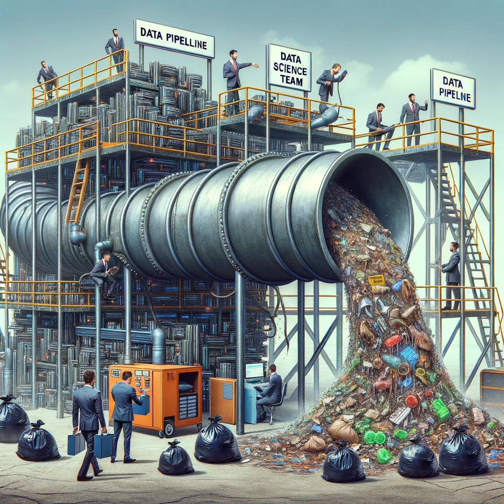
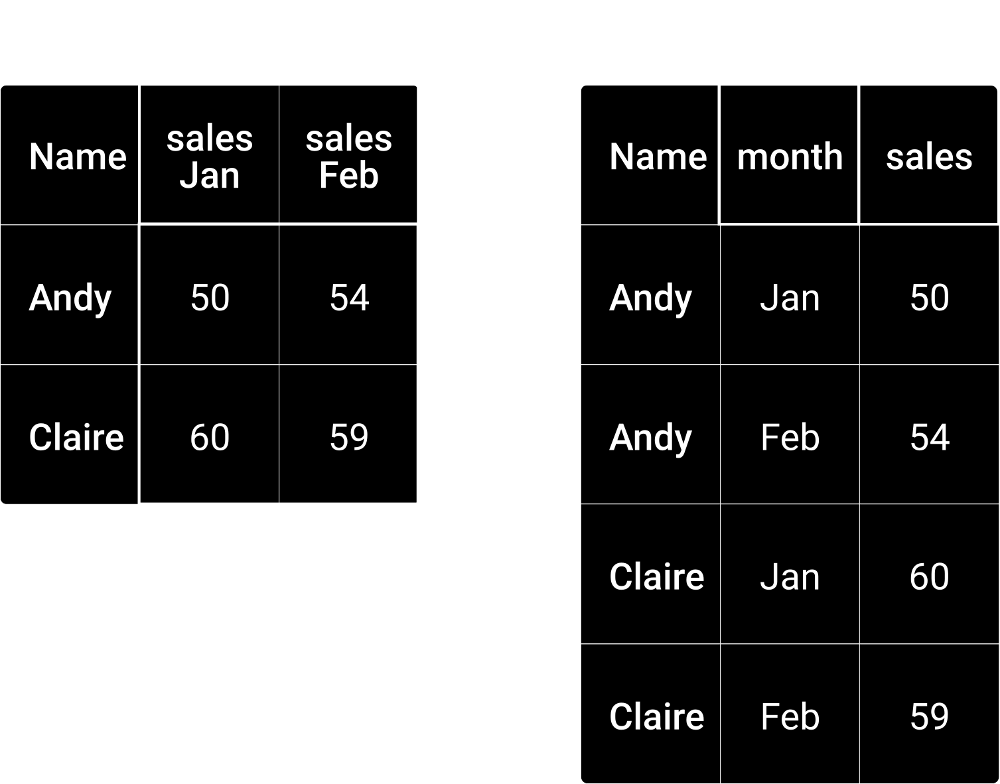

```{r set-options, echo=FALSE, cache=FALSE, warning=FALSE}
options(width = 100)
library(knitr)
knitr::opts_chunk$set(class.source = "chunkstyle")
```

```{css, echo=FALSE}
.chunkstyle {
  background-color: lightgrey;
}

<style>
  .center-vertically {
    display: flex;
    align-items: center;
  }
  .center-vertically img {
    margin-right: 10px;  /* Adjust as needed */
  }
</style>
```


# Welcome back!

# Updates

- Exam for exchange students: 21.12.2023 at 16:15 in room 01-013.
- The mock exam is online 💣


## Part II: Data gathering and preparation {.smaller}

```{r echo = FALSE, warning=FALSE}
library(readxl)
library(knitr)
library(magrittr)
library(kableExtra)

sched <- read_xlsx("../../schedule2023.xlsx", col_types = "text")

#kable(sched[1:7, c(1,5)], format = "markdown")
```

```{r echo = FALSE}
kable(sched[12:15, c(1,5)], format = "markdown") 
```


## Part III: Analysis, visualisation, output {.smaller}

```{r echo = FALSE}
kable(sched[16:nrow(sched), c(1,5)], format = "markdown") 
```


# Work with Data

```{venn echo=FALSE, fig.align='center', out.width="95%"}
include_graphics("../img/venn_diagramm.png")
```

---
```{pipeline echo=FALSE, fig.align='center', out.width="95%"}
include_graphics("../img/data_science_pipeline.png")
```


## Warm up

```{r df, echo=FALSE, out.width = "50%", fig.align='center',  purl=FALSE}
include_graphics("../../img/warmup_dalle.png")
```


## JSON files: open-ended question

Be the JSON file

```{json}
{
  "students": [
    {
      "id": 19091,
      "firstName": "Peter",
      "lastName": "Mueller",
      "grades": {
          "micro": 5,
          "macro": 4.5,
          "data handling": 5.5
          }
    },
    {
      "id": 19092,
      "firstName": "Anna",
      "lastName": "Schmid",
      "grades": {
          "micro": 5.25,
          "macro": 4,
          "data handling": 5.75
          }
    },
    {
      "id": 19093,
      "firstName": "Noah",
      "lastName": "Trevor",
      "grades": {
          "micro": 4,
          "macro": 4.5,
          "data handling": 5
          }
    }
  ]
}
```

Write an R code to extract a table with, as a first column, a vector of first names, and as a second column, the average grade per student. The table can be a data frame or a tibble.


## XML: 

```{xml}
<students>
  <student>
    <id>19091</id>
    <firstName>Peter</firstName>
    <lastName>Mueller</lastName>
    <grades>
      <micro>5</micro>
      <macro>4.5</macro>
      <dataHandling>5.5</dataHandling>
    </grades>
  </student>
  <student>
    <id>19092</id>
    <firstName>Anna</firstName>
    <lastName>Schmid</lastName>
    <grades>
      <micro>5.25</micro>
      <macro>4</macro>
      <dataHandling>5.75</dataHandling>
    </grades>
  </student>
  <student>
    <id>19093</id>
    <firstName>Noah</firstName>
    <lastName>Trevor</lastName>
    <grades>
      <micro>4</micro>
      <macro>4.5</macro>
      <dataHandling>5</dataHandling>
    </grades>
  </student>
</students>
```

- 'students' is the root-node, 'grades' are its children
- the siblings of `Noah Trevor` are Anna Schmid and Peter Mueller
- The code below would be an alternative, equivalent notation for the third student in the xml file above.
```{xml}
<student id="19093" firstName="Noah" lastName="Trevor">
      <grades micro="4" macro="4.5" dataHandling="5" />
</student>
```


# Data Gathering Procedure

## A Template/Blueprint

Tell your future self what this script is all about

```{r eval=FALSE}
#######################################################################
# Project XY: Data Gathering and Import
#
# This script is the first part of the data pipeline of project XY.
# It imports data from ...
# Input: links to data sources (data comes in ... format)
# Output: cleaned data as CSV
# 
# U. Matter, St. Gallen, 2018
#######################################################################


# SET UP --------------
# load packages
library(tidyverse)

# set fix variables
INPUT_PATH <- "/rawdata"
OUTPUT_FILE <- "/final_data/datafile.csv"


# IMPORT RAW DATA FROM CSVs -------------


```


# Goals for today

## Goals for today: cognitive goals

- Recognize where the problems are in a given dataset, and what is in the way of a proper analysis of the data.
- Organize your work: what needs to be addressed first?

## Goals for today: skills

- Use simple string-operations to clean text variables.
- Reshape datasets from wide to long (and vice versa).
- Apply row-binding/stacking of datasets


## The dataset is imported, now what?

- In practice: still a long way to go.
- Parsable, but messy data: Inconsistencies, data types, missing observations, wide format.

## The dataset is imported, now what?

- In practice: still a long way to go.
- Parsable, but messy data: Inconsistencies, data types, missing observations, wide format.
- *Goal* of data preparation: Dataset is ready for analysis.
- *Key conditions*:
  1. Data values are consistent/clean within each variable.
  2. Variables are of proper data types.
  3. Dataset is in 'tidy' (in long format, more on this after the break)!

## "Garbage in garbage out"...

```{r garbage, echo=FALSE, out.width = "60%", fig.align='center',  purl=FALSE}

```


## Move to Nuvolos

<center>

</center>


  

## Tidy data: some vocabulary

Following @wickham_2014:

- *Dataset*: Collection of *values* (numbers and strings).
- Every value belongs to a *variable* and an *observation*.
- *Variable*: Contains all values that measure the same underlying attribute across units.
- *Observation*: Contains all values measured on the same unit (e.g., a person).


## Tidy data

```{r tidydata, echo=FALSE, out.width = "90%", fig.align='center', purl=FALSE, fig.cap="Tidy data. Source: @wickham_grolemund2017, licensed under the [Creative Commons Attribution-Share Alike 3.0 United States](https://creativecommons.org/licenses/by-nc-nd/3.0/us/) license."}
include_graphics("../../img/tidy-1.png")
```

## Reshaping: the concept

```{r widetolong, echo=FALSE, out.width = "65%", fig.align='center',  purl=FALSE}

```


## Stack/row-bind: the concept

```{r rowbinding, echo=FALSE, out.width = "55%", fig.align='center', purl=FALSE}
include_graphics("../../img/rowbinding_dark.png")
```


## Move to Nuvolos

<center>

</center>


# Q&A


<style>
slides > slide { overflow: scroll; }
slides > slide:not(.nobackground):after {
  content: '';
}


</style>

## References {.smaller}

