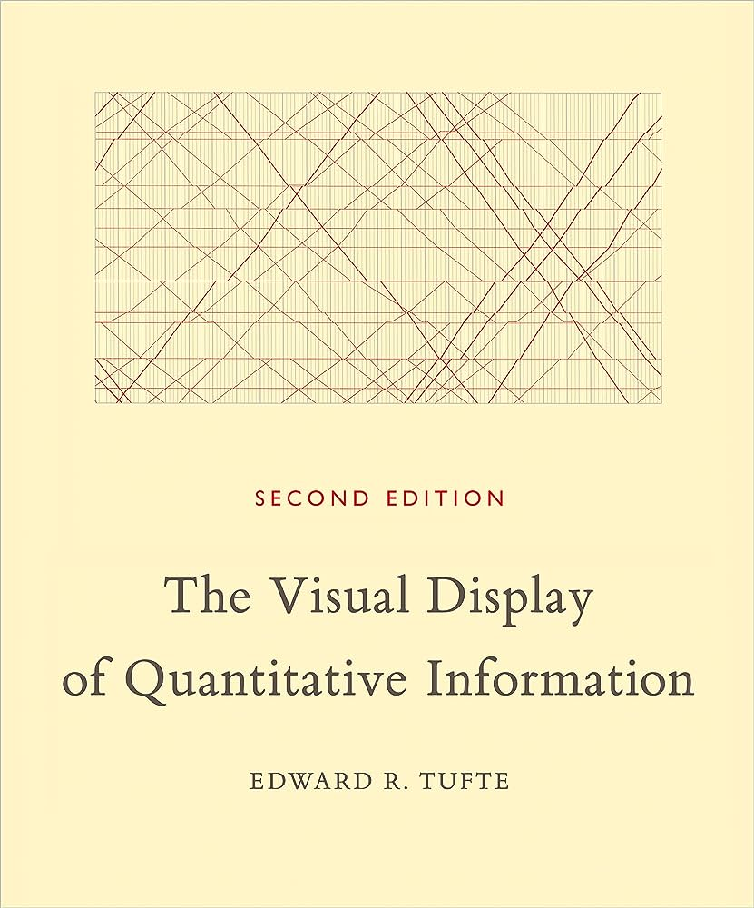

```{r set-options, echo=FALSE, message=FALSE, warning=FALSE, cache=FALSE}
options(width = 100)
library(knitr)
library(dplyr)
library(tidyverse)
library(tidyr)
```

```{=html}
<style>
pre {
  font-size: 21px;
}
</style>
```
```{css, echo=FALSE}
.chunkstyle {
  background-color: lightgrey;
}

<style>
  .center-vertically {
    display: flex;
    align-items: center;
  }
  .center-vertically img {
    margin-right: 10px;  /* Adjust as needed */
  }
</style>
```

# Updates

# Recap

## Cleaning and analytics

1.  Stacking
2.  Merging (joining) datasets
3.  Data manipulation with `tidyverse()`
4.  Aggregation of statistics

## Merging (joining) datasets: R

Overview by @wickham_grolemund2017:

| dplyr (tidyverse)  | base::merge                  |
|--------------------|------------------------------|
| `inner_join(x, y)` | `merge(x, y)`                |
| `left_join(x, y)`  | `merge(x, y, all.x = TRUE)`  |
| `right_join(x, y)` | `merge(x, y, all.y = TRUE)`, |
| `full_join(x, y)`  | `merge(x, y, all = TRUE)`    |

## Data manipulation

-   `arrange()`
-   `select()`
-   `filter()`
-   `mutate()`
-   `group_by()`
-   `summarize()`

## Warm up and test LockDown browser

```{r warmup, echo=FALSE, out.width = "50%", fig.align='center',  purl=FALSE}
include_graphics("../../img/warmup_dalle.png")
```

## Warm up and test LockDown browser

On Canvas, open the survey "LockDown browser test". Answer the questions.

*You must install the LockDown browser on your computer*

## Joining

Consider the following code:

```{r, eval = FALSE}
temperature_conversions <- data.frame(conversion_factor = c(5/9, 1),
                                      scale = c("Fahrenheit", "Celsius"))

temperature <- data.frame(city = c("StGallen", "Zürich", "Detroit"),
                          temp = c(12, 14, 21),
                          scale = c("Cel", "Cel", "F"))
```

Select statements that are true:

-   [`inner_join(temperature, temperature_conversions, by="scale")` returns a data frame with 3 rows.]{style="font-size: smaller;"}
-   [`left_join(temperature, temperature_conversions, by="scale")` returns a data frame with 3 rows.]{style="font-size: smaller;"}
-   [`full_join(temperature, temperature_conversions, by="scale")` returns a data frame with 3 rows.]{style="font-size: smaller;"}

## Data manipulation

Consider the following data frame:

```         
> main_dataset
      city temp      scale conversion_factor
1 StGallen   12    Celsius         1.0000000
2   Zürich   14    Celsius         1.0000000
3  Detroit   40 Fahrenheit         0.5555556
```

Select statements that are true:

-   [`main_dataset |> mutate(temp_celsius = ifelse(scale == "Fahrenheit", (temp-32) * conversion_factor, temp))` replaces the variable `temp` with `temp_celsius`]{style="font-size: smaller;"}
-   [`main_dataset |> mutate(temp_celsius = ifelse(scale == "Fahrenheit", (temp-32) * conversion_factor, temp))` has 3 rows and 5 columns]{style="font-size: smaller;"}
-   [`main_dataset |> summarize(mean_temp = mean(temp), min_temp = min(temp))` returns a tibble containing 2 columns and 1 row]{style="font-size: smaller;"}
-   [`main_dataset |> summarize(mean_scale = mean(scale), sd_scale = sd(scale))` is a good way to get summary statistics about the variable `scale`]{style="font-size: smaller;"}

## Stacking: True or False

Consider the following code:

```{r}
Ostschwiz <- data.frame(
  Region = c("St. Gallen", "Appenzell", "Appenzell"),
  FavoriteBeverage = c("Schützengarten", "Quöllfrisch", "Appenzeller"),
  Year = c(2021, 2021, 2022)
)

Valais <- data.frame(
  Region = c("Valais"),
  FavoriteBeverage = c("Fendant"),
  Year = c(2021)
)

Vaud <- data.frame(
  Region = c("Vaud"),
  FavoriteBeverage = c("Chasselas"),
  Year = c(2021)
)
```

The statement `nrow(rbind(Ostschwiz, Valais, Vaud)) == 5` returns `FALSE`

## Stacking and reshaping: True or False

Consider the following data frame

```{r}
Ostschwiz <- data.frame(
  Region = c("St. Gallen", "Appenzell", "Appenzell"),
  FavoriteBeverage = c("Schützengarten", "Quöllfrisch", "Appenzeller"),
  Year = c(2021, 2021, 2022)
)

Valais <- data.frame(
  Region = c("Valais"),
  FavoriteBeverage = c("Fendant"),
  Year = c(2021)
)

Vaud <- data.frame(
  Region = c("Vaud"),
  FavoriteBeverage = c("Chasselas"),
  Year = c(2021)
)

Ostschwiz <- pivot_wider(Ostschwiz, 
                         names_from = c(Year), 
                         values_from = FavoriteBeverage)
```

The statement `colnames(Ostschwiz)[2]` returns `"FavoriteBeverage`

# Data visualization

## Data visualization

-   Final step of data pipeline/data science procedure!
    -   Convincingly communicating insights from data.
    -   Data visualization is all about *telling a story*.
-   *R* is a very powerful tool to do this!


## Data visualization

-   Data visualization is *THE* most important part of delivering results!
-   Best way to convince people about your message (and about your competence 🎓)

```{r echo= FALSE,out.width="55%", fig.align="center"}
include_graphics("../../img/forecast_plot.png")
```


## Data visualization

Two ways: display data through *tables* or *graphs*.

Depends on the purpose.


## Data visualization

- A *chart* typically contains at least one axis, the **values are represented in terms of visual objects** (dots, lines, bars) and axes typically have scales or labels.

    - If we are interested in exploring, analyzing or communicating *patterns* in the data, *charts are more useful than tables*.
    
<br>

-   A *table* typically contains rows and columns, and the **values are represented by text**.

    - If we are interested in exploring, analyzing or communicating *specific numbers* in the data, *tables are more useful than graphs*.


# Tables

## Tables

-   Formatting data values for publication.
-   Typical: String operations to make numbers and text look nicer.
    -   Before creating a table or figure...


## Tables

```{r message=FALSE}
# load packages and data
library(tidyverse)
data("swiss")

# compute summary statistics
swiss_summary <- swiss |> 
  summarise(avg_education = mean(Education),
            avg_fertility = mean(Fertility),
            N = n()
  )

swiss_summary
```

*Problems?*


## Tables: round numeric values

```{r}
swiss_summary_rounded <- round(swiss_summary, 2)
swiss_summary_rounded
```

## Tables: detailed formatting of numbers

-   Coerce to text.
-   String operations.
-   Decimal marks, units (e.g., currencies), other special characters for special formats (e.g. coordinates).
-   *`format()`*-function


## Tables: `format()` example

```{r}
swiss_form <- format(swiss_summary_rounded,
                     decimal.mark = ",")
swiss_form 
```


## See also the helpful functions for formatting text-strings

-   Uppercase/lowercase: `toupper()`/`tolower()`.
-   Remove white spaces: `trimws()`,

```{r}
string <- "AbCD "
toupper(string)
tolower(string)
trimws(tolower(string))
```


## Get creative with tables: `gtExtras` and sparklines

```{r}
head(USArrests, 10)
```

*Problems?*


## Get creative with tables: `gtExtras` and sparklines

```{r message=FALSE, warning=FALSE}
library(gtExtras)

USArrests_summary <- USArrests |> 
  mutate(UrbanPop = case_when(UrbanPop > quantile(UrbanPop, .66) ~ "High",
                                UrbanPop > quantile(UrbanPop, .33) ~ "Middle",
                                UrbanPop > 0 ~ "Low")) |> 
  group_by(UrbanPop) |> 
  summarize(
    "Mean murder" = mean(Murder),
    "SD murder" = sd(Murder),
    Density = list(Murder),
    .groups = "drop"
  )
```


## Get creative with tables: `gtExtras` and sparklines

```{r}

USArrests_summary |> 
  gt() |> 
  tab_header(
    title = md("Murder rates"),
    subtitle = md("Per high, middle, and low urban population ")
  ) |> 
  gtExtras::gt_plt_dist(Density, type = "density", line_color = "black", 
                         fill_color = "red") %>%
  fmt_number(columns = `Mean murder`:`SD murder`, decimals = 2)


```


## Get creative with tables: other sources

-   `kable()` for `html` / Markdown reports
-   `stargazer` for your LaTeX reports or for your Office Word reports

## Get creative with tables: `kable()`

```{r}
knitr::kable(head(USArrests, 5), format = "markdown")
```

## Get creative with tables: `kable()`

```{r}
knitr::kable(head(USArrests, 5), format = "html")
```


# Graphs with R (ggplot2)


## Graphs with R

Three main approaches:

1.  The original `graphics` package ([@r_2018]; shipped with the base R installation).


## Graphs with R

Three main approaches:

1.  The original `graphics` package ([@r_2018]; shipped with the base R installation).
2.  The `lattice` package [@lattice_2008], an implementation of the original Bell Labs 'Trellis' system.

## Graphs with R

Three main approaches:

1.  The original `graphics` package ([@r_2018]; shipped with the base R installation).
2.  The `lattice` package [@lattice_2008], an implementation of the original Bell Labs 'Trellis' system.
3.  The *`ggplot2`* package [@wickham_2016], an implementation of Leland Wilkinson's 'Grammar of Graphics'.


## Graphs with R

Three main approaches:

1.  The original `graphics` package ([@r_2018]; shipped with the base R installation).
2.  The `lattice` package [@lattice_2008], an implementation of the original Bell Labs 'Trellis' system.
3.  The *`ggplot2`* package [@wickham_2016], an implementation of Leland Wilkinson's 'Grammar of Graphics'.

`ggplot2` is so good that it has become *THE* reference [In python, use `plotnine` to apply the grammar of graphics.]


## Grammar of graphics

```{r echo= FALSE,out.width="55%", fig.align="center"}
include_graphics("../../img/grammargraphics.jpg")
```


## `ggplot2`

```{r echo= FALSE, out.width= "25%", fig.align="center"}
include_graphics("../../img/ggplot2.png")
```


## `ggplot2` basics

Using `ggplot2` to generate a basic plot in R is quite simple. Basically, it involves three key points:

1.  The data must be stored in a `data.frame`/`tibble` (in tidy format!).


## `ggplot2` basics

Using `ggplot2` to generate a basic plot in R is quite simple. Basically, it involves three key points:

1.  The data must be stored in a `data.frame`/`tibble` (in tidy format!).
2.  The starting point of a plot is always the function `ggplot()`.


## `ggplot2` basics

Using `ggplot2` to generate a basic plot in R is quite simple. Basically, it involves three key points:

1.  The data must be stored in a `data.frame`/`tibble` (in tidy format!).
2.  The starting point of a plot is always the function `ggplot()`.
3.  The first line of plot code declares the data and the 'aesthetics' (e.g., which variables are mapped to the x-/y-axes):


## `ggplot2` basics

Using `ggplot2` to generate a basic plot in R is quite simple. Basically, it involves three key points:

1.  The data must be stored in a `data.frame`/`tibble` (in tidy format!).
2.  The starting point of a plot is always the function `ggplot()`.
3.  The first line of plot code declares the data and the 'aesthetics' (e.g., which variables are mapped to the x-/y-axes):

```{r echo=TRUE, eval=FALSE}
ggplot(data = my_dataframe, aes(x= xvar, y= yvar))
```


## Example data set: `swiss`

```{r echo=TRUE}
library(tidyverse) # automatically loads ggplot2

# load the data
data(swiss)
head(swiss)
```


## Add indicator variable

Code a province as 'Catholic' if more than 50% of the inhabitants are catholic:

```{r}

# via tidyverse/mutate
swiss <- mutate(swiss, 
                Religion = 
                  ifelse(50 < Catholic, 'Catholic', 'Protestant'))

# 'old school' alternative
swiss$Religion <- 'Protestant'
swiss$Religion[50 < swiss$Catholic] <- 'Catholic'

# set to factor
swiss$Religion <- as.factor(swiss$Religion)

```


## Data and aesthetics

```{r echo=TRUE, out.width="85%", fig.width=6,fig.height=2.8}
ggplot(data = swiss, aes(x = Education, y = Examination))

```


## Geometries (\~the type of plot)

```{r echo=TRUE, out.width="85%", fig.width=6,fig.height=2.8}
ggplot(data = swiss, aes(x = Education, y = Examination)) + 
     geom_point()

```


## Facets

```{r echo=TRUE, out.width="85%", fig.width=6,fig.height=2.8}
ggplot(data = swiss, aes(x = Education, y = Examination)) + 
     geom_point() +
     facet_wrap(~Religion)

```


## Additional layers and statistics

```{r echo=TRUE, out.width="85%", fig.width=6,fig.height=2.8, message=FALSE}
ggplot(data = swiss, aes(x = Education, y = Examination)) + 
     geom_point() +
     geom_smooth(method = 'loess') +
     facet_wrap(~Religion)
```


## Additional layers and statistics

```{r echo=TRUE, out.width="85%", fig.width=6,fig.height=2.8, message=FALSE}
ggplot(data = swiss, aes(x = Education, y = Examination)) + 
     geom_point() +
     geom_smooth(method = 'lm') +
     facet_wrap(~Religion)
```


## Additional aesthetics

```{r echo=TRUE, out.width="85%", fig.width=6,fig.height=2.8, message=FALSE}
ggplot(data = swiss, aes(x = Education, y = Examination)) + 
     geom_point(aes(color = Agriculture)) +
     geom_smooth(method = 'lm') +
     facet_wrap(~Religion)
```


## Change coordinates

```{r echo=TRUE, out.width="85%", fig.width=6,fig.height=2.8, message=FALSE}
ggplot(data = swiss, aes(x = Education, y = Examination)) + 
     geom_point(aes(color = Agriculture)) +
     geom_smooth(method = 'lm') +
     facet_wrap(~Religion) +
     coord_flip()
```


## Themes

```{r echo=TRUE, out.width="85%", fig.width=6,fig.height=2.8, message=FALSE}
ggplot(data = swiss, aes(x = Education, y = Examination)) + 
     geom_point(aes(color = Agriculture)) +
     geom_smooth(method = 'lm') +
     facet_wrap(~Religion) +
     theme(legend.position = "bottom", axis.text=element_text(size=12) ) 
```

## Themes

```{r echo=TRUE, out.width="85%", fig.width=6,fig.height=2.8, message=FALSE}
ggplot(data = swiss, aes(x = Education, y = Examination)) + 
     geom_point(aes(color = Agriculture)) +
     geom_smooth(method = 'lm') +
     facet_wrap(~Religion) +
     theme_minimal()
```

<!-- ## Themes -->

<!-- ```{r echo=TRUE, out.width="85%", fig.width=6,fig.height=2.8, message=FALSE} -->
<!-- ggplot(data = swiss, aes(x = Education, y = Examination)) +  -->
<!--      geom_point(aes(color = Agriculture)) + -->
<!--      geom_smooth(method = 'lm') + -->
<!--      facet_wrap(~Religion) + -->
<!--      theme_dark() -->
<!-- ``` -->

## Themes

```{r echo=TRUE, fig.height=2.8, fig.width=6, message=FALSE, warning=FALSE, out.width="85%"}
library(ggthemes)

ggplot(data = swiss, aes(x = Education, y = Examination)) + 
     geom_point() +
     geom_smooth(method = 'lm') +
     facet_wrap(~Religion) +
     theme_economist()
```


## Cheat sheet

```{r, echo=FALSE, out.width = "70%", fig.align='center',  purl=FALSE}
include_graphics("../../img/ggplotcheat.png")
```

Link: https://rstudio.github.io/cheatsheets/html/data-visualization.html


## Data visualization

- Values are represented by their *position relative to the axes*: line charts and scatterplots.

- Values are represented by the *size of an area*:  bar charts and area charts. 

- Values are *continuous*: use chart type that visually connects elements (line chart).

- Values are *categorical*: use chart type that visually separates elements (bar chart).

(Source: https://hhsievertsen.github.io/EconDataBook/data-visualization-basics.html)


## Data visualization: some principles

- Two pieces of advice I personally received: 
    - *fit your whole story in one graph*.
    - your audience should understand your graph *without the need of listening to you* or *reading your text.*

<br>

- Be simple and avoid fanciness.
- Avoid pie charts and 3D charts. 


## Data visualization: some principles

:::: {style="display: flex;"}

::: {}
Recommendations from Tufte
:::

::: {}
```{r, echo=FALSE, out.width = "50%", fig.align='center',  purl=FALSE}

```
:::

::::


## Data visualization: some principles

We can quantify the Lie Factor of a graph


:::: {style="display: flex;"}

::: {}
<br>

<br>

Lie Factor = $\frac{\text{size of effect shown in graphic}}{\text{size of effect in data}}$
:::

::: {}
```{r, echo=FALSE, out.width = "60%", fig.align='center',  purl=FALSE}
include_graphics("../../img/yangPOLL.jpg")
```
:::

::::


## Thou shalt not truncate the Y axis.

```{r, echo=FALSE, out.width = "50%", fig.align='center',  purl=FALSE}
include_graphics("../../img/carlson.png")
```


## Data visualization: some principles

Only what matters should be reported (*Data-ink Ratio*):


Data-ink Ratio = $\frac{\text{ink used for data}}{\text{total ink used to print the graphic
}}$


```{r echo=FALSE, message=FALSE, warning=FALSE, fig.align='center'}
library(gridExtra)

plot1 <- mtcars |> 
  group_by(cyl) |> 
  count() |> 
  ggplot(aes(x = as.factor(cyl), y = n, fill = as.factor(cyl), label = n)) +
  geom_bar(stat = "identity") +
  labs(x = "cyl",
       y = "count") +
  geom_label(show.legend = FALSE)


plot2 <- mtcars |> 
  group_by(cyl) |> 
  count() |> 
  ggplot(aes(x = as.factor(cyl), y = n)) +
  geom_bar(stat = "identity") +
  labs(x = "cyl",
       y = "count") +
  theme_tufte()

grid.arrange(plot1, plot2, ncol=2)

```


## Conclusion

Data visualization is an art of story-telling, deception, and scientific exactitude 🤓.


# Q&A

```{=html}
<style>
slides > slide { overflow: scroll; }
slides > slide:not(.nobackground):after {
  content: '';
}


code {
  color: white;
}


pre {
  color: white;
}
</style>
```
## References {.smaller}
